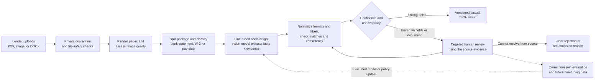
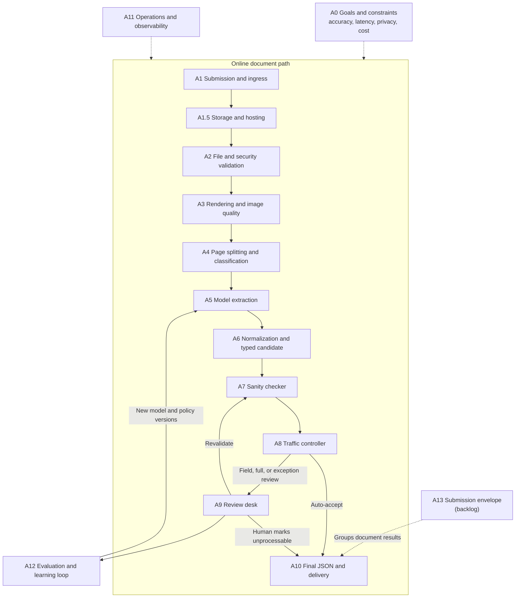

# Part A: System Design

## System at a glance

The system accepts a lender's document package, checks that each file is safe to
open, turns it into model-ready pages, and separates the pages into logical bank
statements, W-2s, or pay stubs. A fine-tuned open-weight vision model extracts
only facts visible in each document, including field-level evidence. Typed
normalization then standardizes formats and labels while checking that values
remain attached to the proposed field, row, and current-versus-YTD column.
Deterministic rules catch missing or inconsistent values without rearranging
them to make the arithmetic work. A confidence policy automatically accepts
strong results and sends only the uncertain fields or documents that automation
cannot safely resolve to a human. The policy is deliberately tuned to minimize
human work while preserving the accuracy gate, but the design never assumes
review can be eliminated. The final output is versioned JSON; it does not guess
unsupported facts or make an underwriting decision.



### How the design meets the brief

- **Private, in-house processing:** document bytes, local decoders, model
  inference, and review evidence remain inside the company-controlled cloud
  account and private network. Commercial document or model APIs are not the
  primary engine.
- **99%+ field-accuracy target:** this is a customer outcome measured on the
  final fields delivered after any required review. Model output, deterministic
  checks, and human correction all contribute to that result. Automatic accuracy
  and review volume are tracked separately so human work cannot hide a weak or
  expensive automatic path. Individual stages also receive isolated evaluation:
  for example, A6 separately measures formatting, row and column matching,
  label mapping, ambiguity detection, and unsupported-value synthesis before
  the same cases are tested end to end. The design does not claim the target has
  already been measured.
- **Under-60-second target:** the standard-path SLO is p95 under 60 seconds from
  finalized upload to an automatic result or a review-ready disposition. Human
  completion and legitimately oversized documents have separate service levels.
- **Cost control:** inexpensive bounded CPU checks reject unusable files before
  rendering or GPU inference. The open-weight model runs only at extraction,
  and targeted field review avoids paying for full-document review when a small
  correction is sufficient.
- **Human review:** reviewers see the original page, highlighted evidence, the
  proposed value, and the reason for escalation. Corrections are revalidated
  before delivery and later become evaluated training candidates. Review is an
  exception path that the model, rules, evidence, and targeted routing are
  intended to minimize, not a capability the system promises will never be
  needed.
- **Document-supported facts only:** the system preserves the original source,
  returns explicit `null` values when support is absent, flags uncertain
  readings, and never annualizes income or makes lending decisions.

## Detailed reference map

Use the `A0` through `A13` labels to refer to design sections in future work
sessions. The numbered path is the online document-processing flow; the lower
sections apply across or feed back into that path.



| Label | Design section | Current status |
| --- | --- | --- |
| A0 | Goals and constraints | Customer-facing accuracy definition locked; other policy inputs open |
| A1 | Submission creation and document ingress | Draft complete; policy inputs open |
| A1.5 | Storage and hosting foundation | Draft complete; policy inputs open |
| A2 | File and security validation | Draft complete; policy inputs open |
| A3 | Rendering and image-quality assessment | Draft complete; tool benchmarks and thresholds open |
| A4 | Document classification and conditional splitting | Draft in progress; file-boundary fast path locked |
| A5 | Fine-tuned open-weight model extraction | Pipeline sketch complete; production validation and review policy open |
| A6 | Normalization and typed candidate | Draft complete; prototype alignment with A10 pending |
| A7 | Sanity checker (deterministic validation) | Draft complete; pay-stub rules implemented and production policy inputs open |
| A8 | Traffic controller (confidence calibration and routing) | Draft complete; pay-stub router implemented and calibration pending |
| A9 | Review desk (human correction and revalidation) | Draft complete; UI mock created and production staffing inputs open |
| A10 | Final typed JSON and delivery | Contract locked and prototype implemented |
| A11 | Reliability, latency, cost, security, and observability | Not started |
| A12 | Accuracy evaluation, feedback, and fine-tuning | Not started |
| A13 | Multi-document submission envelope | Backlog |

## A0 - Project-wide success definition

### Evaluation plan

The primary accuracy target is defined from the customer's point of view:

> **Customer field accuracy:** at least 99% of the final field instances
> delivered to the lender match verified ground truth after field-specific
> normalization, including any corrections made through human review.

It is measured by running original held-out documents through the complete
pipeline, so errors caused by rendering, classification, splitting, extraction,
normalization, validation, or review all count against the same outcome. A wrong,
missing, malformed, misassigned, or unsupported extra value is an error.
Repeated transaction and line-item cells are individual field instances.
Optional fields that are absent from the document do not create free correct
answers; returning a value for one is an unsupported-extra error.

The release result must report customer field accuracy overall and for each
supported document type so a strong aggregate cannot hide a weak bank-statement,
W-2, or pay-stub path. Results are also sliced by critical field family, image
quality, format familiarity, and automatic-versus-reviewed outcome. Unusable
inputs may be excluded from field accuracy only through the predeclared A2/A3
policy; their rejection rate remains visible.

**Automatic field accuracy** before human correction is a leading operational
indicator, not the primary customer target. It is reported with straight-through
coverage, review rate, correction rate, rejection rate, and review completion
time. This prevents the system from appearing successful by routing most work to
people. Accuracy, speed, and cost remain separate gates: human correction may
improve final accuracy, but its latency and cost are still charged to the system.

A12 will define the held-out sampling, normalization rules, and statistical
report. No component or model is described as having achieved 99% until this
end-to-end evaluation has been run.

## A1 - Submission creation and document ingress

The ingress boundary accepts untrusted document bytes into the controlled
environment without interpreting them as financial facts. It creates stable
identifiers, preserves the original upload, and hands the artifact to A2. No
customer document is sent to a third-party extraction or inference API.

### Identity and granularity

Ingress uses three identifiers because an uploaded file and a logical document
are not always the same thing:

- `submission_id` identifies the customer's processing request. It can exist
  before the A13 submission envelope is implemented.
- `source_artifact_id` identifies one immutable uploaded PDF or image.
- `document_id` identifies one logical document after A4 splits and classifies
  the source. A source may produce zero, one, or several document IDs.

This separation accommodates a PDF containing several W-2s without changing the
locked one-pay-stub A10 result. For the pay-stub-only prototype, a submission has
one source artifact, but that prototype simplification is not an API invariant.

### Ingress protocol

1. An authenticated tenant calls `POST /v1/submissions` with an idempotency key
   and declares the source count. The service authorizes the tenant, creates the
   submission, and returns a `submission_id`.
2. For each source, the service creates a `source_artifact_id` and a short-lived,
   single-purpose upload authorization for the quarantine area of the private
   object store. Direct upload avoids relaying document bytes through the API
   fleet. TLS protects the upload in transit.
3. The client uploads the bytes plus a declared length and media type. Both are
   treated as hints, not security decisions.
4. The client finalizes the source. The service verifies that an object exists
   at the issued key, records its observed byte length, and durably enqueues A2.
   It then returns `202 Accepted` and a status URL.
5. Repeating either creation or finalization with the same tenant-scoped
   idempotency key returns the original identifiers and does not enqueue a
   second processing run.

Upload authorizations permit writing one generated object key only; they cannot
list or read the store. They expire, and an unfinalized object is deleted by a
short lifecycle rule. User-supplied filenames are metadata, never object keys,
and are not written to application logs.

### Evidence integrity, latency, cost, and review boundary

- Ingress preserves the exact uploaded bytes. It does not resize, recompress,
  repair, or otherwise alter evidence before validation. A2 records a SHA-256
  digest for later integrity checks.
- The internal under-60-second processing clock starts separately for each
  source when that source is successfully finalized. End-to-end client time,
  including upload, is reported separately because it depends on file size and
  the client's network. A13 must define any later package-level clock. This SLO
  definition is a design decision, not a measured result.
- A1 and A2 together receive an initial target budget of five seconds at p95 for
  standard-path sources: one second for finalization and queueing and four
  seconds for security validation. Load tests must confirm or revise this
  allocation while retaining the end-to-end target.
- Direct-to-object-store upload, one durable queue message per source, and CPU
  validation before any GPU work limit infrastructure cost and avoid spending
  model capacity on unusable input.
- A1 never asks an extraction reviewer to inspect an upload. Retryable transport
  failures are retried automatically; actionable client errors are returned to
  the caller; suspicious files are isolated for security operations in A2.

### Evaluation plan

Before release, exercise the A1 API and queue handoff with valid, duplicate,
partial, oversized, unauthorized, and cross-tenant requests. Integration tests
must prove that idempotent retries create one source and one A2 task, that
unfinalized uploads cannot enter processing, and that one tenant cannot address
another tenant's object or status. Failure-injection tests cover a worker or API
crash between object creation, metadata commit, and queue publication. Load tests
measure finalization and queue latency, request error rates, and infrastructure
cost by source size and concurrency against A1's provisional p95 budget. A log
inspection test confirms that document bytes, filenames, and extracted content
are absent from application logs.

## A1.5 - Storage and hosting foundation

The initial production topology is one company-controlled cloud environment in
one region, with multi-zone durability for the online control plane. Managed
storage, database, queue, key-management, and compute services inside the
company account and private network are controlled infrastructure for this
design; physical on-premises hosting is not required. The public ingress
endpoint is the only internet-facing component. Object storage, metadata
storage, queues, CPU workers, and the later model-serving network are private
and have no unrestricted outbound network access. Customer document bytes and
inference requests remain inside this boundary. A dedicated account, region, or
on-premises deployment is a customer-specific deployment variant, not the
default architecture.

### Components and responsibility

| Component | Responsibility |
| --- | --- |
| Ingress API | Authentication, tenant authorization, IDs, idempotency, finalization, and status reads |
| Private object store | Immutable original sources and versioned derived artifacts |
| Relational metadata store | Tenant ownership, object references, state transitions, attempts, policy versions, and timestamps |
| Durable work queue | At-least-once handoff between A1, A2, and later stages |
| CPU validation workers | Bounded file inspection in an isolated, networkless runtime |
| Key and secret manager | Encryption keys and service credentials; no secrets in source or logs |

The object store is encrypted at rest with company-controlled access policy.
The metadata database contains references and processing state; it is not a
second copy of document bytes. Original objects are immutable. Derived images
or text created by later stages use separate keys linked to the source and the
pipeline version.

### Isolation and state

Every metadata row and object key is tenant-scoped. Service identities receive
only the operations required by their stage:

- the upload authorization can write one quarantine key;
- A2 can read quarantined sources and write validation results;
- A3 and later stages can obtain a source only after A2 records `VALIDATED`;
- human-review access, when designed in A9, must be time-bounded and audited;
- model-serving workers cannot make public internet requests.

The metadata store is the authority for this state machine:

```text
CREATED -> UPLOADING -> STORED_QUARANTINED -> VALIDATING
                                             |-> VALIDATED
                                             |-> REJECTED_CLIENT
                                             |-> QUARANTINED_SECURITY
                                             `-> FAILED_RETRYABLE -> VALIDATING
```

Workers claim a versioned task, make the state update durably, and acknowledge
the queue message afterward. At-least-once delivery is therefore safe: a worker
can repeat the same stage without creating a second logical artifact or result.
Stage attempt IDs and policy versions provide the audit trail; logs contain IDs,
durations, byte counts, and reason codes rather than document contents.

### Storage policy and cost controls

- Store one immutable original rather than copying it between pipeline stages.
  Later access is authorized from validation state, not from a second "clean"
  copy.
- Autoscale the stateless API and CPU workers from request and queue depth. GPU
  capacity is not used until A5.
- A same-tenant retry with the same digest may reuse a successful validation
  only when the validator and policy versions also match. Do not deduplicate
  across tenants, which could reveal that another tenant uploaded the same file.
- Apply lifecycle deletion to abandoned uploads and derived artifacts. The
  retention period for originals, review evidence, audit metadata, and backups
  must come from customer, legal, and compliance policy; the brief supplies no
  duration, so this design does not invent one.
- Keep the latency-sensitive path in one region. Cross-region document
  replication is not enabled by default because its privacy, recovery, and cost
  requirements are not specified; A11 will define recovery objectives.

### Evaluation plan

Test the storage foundation with negative tenant-isolation and service-identity
tests, encryption and key-rotation checks, and lifecycle-policy verification on
abandoned and derived objects. Replay queue messages and terminate workers at
each state transition to prove that at-least-once delivery is idempotent and
does not create duplicate logical artifacts. Restore and multi-zone failure
exercises must be evaluated against the recovery objectives once A11 defines
them. Production-like load tests report database and queue latency, storage
growth, worker utilization, and infrastructure cost per processed source; the
section makes no unmeasured durability, recovery-time, or cost claim.

## A2 - File and security validation

A2 is a technical safety gate, not a document classifier and not an extraction
stage. The practical order is **quarantine first, inspect second**: the service
must receive the bytes before it can inspect them, but only the isolated A2
worker can read a quarantined source. A2 answers whether A3 can safely open the
file. It does not determine the document type or verify any financial field.

The gate protects the renderer from four classes of input: unreadable or
encrypted files, malware or active content, malformed structures that exploit
a decoder, and files that exhaust CPU, memory, or storage when expanded. It does
not reject a document merely because its layout is unfamiliar or its image
quality is poor; those cases belong to A3, A4, and the later confidence and
human-review path.

### Versioned validation policy

The worker applies these checks in order, stopping when continuing would be
unsafe or wasteful:

1. **Stored-object integrity.** Confirm tenant ownership, finalized state,
   nonzero length, and agreement with the observed upload length. Stream the
   bytes once to compute SHA-256.
2. **Actual file type.** Inspect file signatures and parse with an allowlisted
   local decoder. Never trust an extension or declared media type. The initial
   policy supports PDF, JPEG, PNG, TIFF, and DOCX. A DOCX is inspected as an
   Office Open XML package and rendered by a local, networkless converter in A3.
   Macro-enabled Office files, embedded executable objects, and legacy `.doc`
   files are not part of the initial fast path.
3. **Malware and active content.** Run an in-environment malware scanner. Reject
   or quarantine PDFs with executable launch actions, JavaScript, or embedded
   payloads, and Office packages with macros, executable embedded objects, or
   external relationships that the extraction path does not need.
   Password-protected or encrypted files return an actionable resubmission error
   because the pipeline cannot inspect their contents.
4. **Resource-abuse guardrails.** Enforce a high hard ceiling on compressed
   bytes, image dimensions, decoded bytes, parser time, memory, and object
   nesting to contain decompression bombs and denial-of-service inputs. Apply a
   separate standard-path threshold for page count and ordinary file size. A
   legitimate source above the standard threshold but below the hard ceiling is
   marked for an oversized processing lane rather than classified as malicious.
   Numerical values must be selected from the production document distribution
   and load tests, not invented from the take-home brief.
5. **Structural readability.** Parse all PDF page objects, fully decode the
   image, or validate the DOCX package structure and referenced parts inside a
   disposable worker with no network, a read-only runtime, and bounded CPU and
   memory. A structurally invalid source is not silently repaired because a
   repair could change the evidentiary bytes.
6. **Commit and handoff.** Record the digest, detected type, page count when
   available, validation policy version, timings, and reason codes. Mark the
   source `VALIDATED` and publish A3 only after that transaction succeeds.

The scanner definitions, decoders, and validation policy are versioned. Malware
scanning reduces risk but is not described as proof that a file is harmless;
the networkless, resource-bounded renderer remains a second containment layer.

### Outcomes

| Outcome | Examples | Next action |
| --- | --- | --- |
| `VALIDATED` | Allowlisted and structurally readable; includes `STANDARD` or `OVERSIZED` processing lane | Enqueue the corresponding A3 lane |
| `REJECTED_CLIENT` | Empty, unsupported, encrypted, structurally invalid, or above a disclosed hard safety ceiling | Return a specific safe reason and resubmission guidance |
| `QUARANTINED_SECURITY` | Malware signal, active payload, or ambiguous security finding | Block all downstream access; alert security operations |
| `FAILED_RETRYABLE` | Scanner, storage, or worker infrastructure failure | Retry with bounded exponential backoff, then alert operations |

Ordinary extraction reviewers never receive quarantined, encrypted, or unsafe
files. Security operations may inspect a quarantined source under a separate
audited role. Low resolution, rotation, handwriting, unfamiliar layouts, and
other potentially legitimate content continue to A3 rather than becoming A2
security rejections.

### Latency, privacy, cost, and review accounting

- **Under 60 seconds:** Type detection, hashing, and malware scanning share a
  streaming read where the implementations permit it; inexpensive checks fail
  early; parsers have hard time and resource bounds. The initial A2 design
  budget is four seconds at p95 for standard-path sources and must be load-tested.
  The full standard-path SLO is p95 under 60 seconds from source finalization to
  either an automatic result or a review-ready disposition. Human-review
  completion and the oversized lane have separate service levels.
- **In-house inference and privacy:** A2 uses local decoders and an
  in-environment malware scanner. It sends neither bytes nor extracted content
  to public scanning, OCR, or model APIs. Logs and metrics exclude filenames,
  document text, and rendered images.
- **Cost:** All A2 work is bounded CPU work. Early rejection prevents rendering
  and GPU inference for unusable sources, and a version-matched same-tenant scan
  cache can avoid exact duplicate work.
- **Human review:** Human data-entry review is reserved for uncertain financial
  facts later in the pipeline. Client-correctable file failures return clear
  errors; security ambiguity goes to security operations; infrastructure errors
  retry automatically.

### Evaluation plan

Run A2 against a versioned corpus containing supported benign files, malformed
structures, encrypted files, active-content samples, malware test fixtures,
decompression bombs, and legitimate files near each resource limit. Report
false rejection and unsafe-pass rates by file type and reason code, then fuzz the
allowlisted parsers inside the same time and memory limits used in production.
Integration tests must prove that only `VALIDATED` sources reach A3 and that
quarantined objects are unavailable to ordinary processing identities. Load
tests measure p95 duration, peak memory, CPU cost, and retry behavior by size and
page count. Every scanner, decoder, or policy update reruns the frozen corpus
before promotion.

### Production policy inputs still required

The architecture is implementable without treating unspecified business policy
as fact. Before production, owners must supply:

- numerical hard safety ceilings and standard-lane thresholds, selected from
  observed source distributions and load tests;
- customer authentication and tenant-isolation requirements;
- regional residency, backup, recovery, retention, legal-hold, and deletion
  requirements;
- whether signed PDFs, portfolio PDFs, attachments, password handoff, legacy
  `.doc`, or macro-enabled Office files are valid customer workflows;
- security-operations response time and the appeal path for false positives;
- whether duplicate submission should return the prior result or create a new
  business event linked to the same source bytes.

## A3 - Rendering and image-quality assessment

A3 turns an A2-validated source into consistent, traceable page images and
decides whether those images are suitable for classification and extraction. It
is an automated preprocessing and quality stage. It does not identify the
document type, extract financial fields, or call the A5 vision-language model.

### Execution and initial toolchain

A versioned A3 task is consumed from the durable work queue by an autoscaling CPU
worker inside the private processing network. The worker can read only a source
whose metadata state is `VALIDATED`; it has bounded CPU and memory, a disposable
filesystem, and no public network access. On success it writes versioned derived
page artifacts to private object storage, commits their metadata, and enqueues
A4. The commit precedes queue acknowledgement so that an at-least-once delivery
can safely repeat the same render profile without creating a second logical
artifact.

The initial local toolchain to benchmark is:

- **PDF:** Poppler as the primary page renderer, with MuPDF retained as a
  fidelity and performance comparison before the production choice is locked;
- **raster images:** libvips for bounded decode, resize, and encode operations,
  with OpenCV for geometric correction and quality measurements;
- **DOCX:** headless LibreOffice in a networkless worker to create a derived PDF,
  followed by the same PDF rendering path.

Tool and configuration versions are part of the render-policy version. Final
selection requires fidelity, latency, resource-use, security, and licensing
review on the representative document corpus. No external conversion, OCR, or
image-processing API receives customer content.

### Page preparation

The worker applies this sequence:

1. Reconfirm the source ID, validation state, detected type, digest, processing
   lane, and render-policy version from the A2 handoff.
2. Decode the source under the A2 resource bounds. Apply trusted PDF page-rotation
   metadata or image EXIF orientation. Convert a supported DOCX locally before
   entering the PDF path.
3. Render every source page with one versioned standard profile. Resolution,
   color mode, image format, and dimension limits are configuration selected by
   corpus benchmarks rather than values invented from the brief.
4. Measure page-level signals independently, including blur, contrast,
   effective resolution, blankness, remaining rotation or skew, and evidence of
   clipped page content. A favorable average must not hide a severe individual
   defect such as a missing edge.
5. Apply only bounded, non-generative corrections: trusted orientation,
   high-confidence quarter-turn rotation, modest deskew, and conservative
   brightness or contrast normalization. A3 does not invent pixels, sharpen
   text into a new reading, remove marks, or automatically crop document
   content. The immutable source remains the evidentiary original.
6. Record the result and quality disposition transactionally. `READY` and
   `READY_WITH_WARNING` pages continue to A4; other outcomes stop or retry as
   described below.

The default path renders one canonical model image per page. A controlled
higher-resolution retry is allowed only when a versioned quality rule requests
it and the source contains enough information to benefit. This avoids storing
or sending several large versions of every page to A5.

### Page artifact and evidence mapping

Each derived page record contains at least:

```json
{
  "page_id": "page_123_1",
  "source_artifact_id": "src_123",
  "source_page_number": 1,
  "image_ref": "derived/src_123/render-v1/page-1.png",
  "pixel_width": 1650,
  "pixel_height": 2200,
  "render_policy_version": "render-v1",
  "transform_to_source": [1, 0, 0, 1, 0, 0],
  "quality_disposition": "READY_WITH_WARNING",
  "quality_signals": {
    "blur": "PASS",
    "contrast": "WARNING",
    "content_clipping": "PASS"
  },
  "warnings": ["LOW_CONTRAST"]
}
```

The dimensions above illustrate the contract and are not the selected render
profile. `transform_to_source` records how coordinates on the prepared image map
back to the original page. A5 can therefore return normalized evidence boxes on
the model image while A9 reliably highlights the corresponding area of the
original source. Photometric changes such as contrast normalization are also
recorded in the page provenance even though they do not change coordinates.

### Quality outcomes and human boundary

| Outcome | Meaning | Next action |
| --- | --- | --- |
| `READY` | The page meets all required quality gates | Enqueue A4 |
| `READY_WITH_WARNING` | The page is usable, but one or more nonfatal signals may reduce downstream confidence | Enqueue A4 with page warnings |
| `RESUBMIT_REQUIRED` | Important content is irrecoverably blurred, clipped, blank, or otherwise unavailable | Return a specific request for a clearer or complete source |
| `FAILED_RETRYABLE` | Rendering or worker infrastructure failed rather than the document | Retry with bounded backoff, then alert operations |

A3 does not routinely enqueue a human reviewer. Safe mechanical problems are
corrected automatically, borderline but usable pages continue with warnings,
and content that is not present or readable results in resubmission guidance.
Human review is reserved primarily for later stages where a readable page
supports an uncertain financial value. Any rare manual exception to the A3
policy must be separately authorized and audited rather than becoming the
normal quality path.

### Latency, cost, and open production inputs

- A3 uses autoscaling CPU workers and no extraction GPU. Independent pages may
  render concurrently, subject to a per-source concurrency cap so one long file
  cannot monopolize the fleet. A2 already routes legitimate oversized sources
  to a separate lane.
- Rendering the smallest image profile that preserves required text limits CPU,
  storage, queue payload, and later GPU cost. Early blank or unusable-page
  detection avoids A4 and A5 work that cannot produce a trustworthy result.
- Derived images are stored once under a versioned key and follow the lifecycle
  policy defined in A1.5. The original source, not a chain of intermediate image
  copies, remains the permanent evidence.
- A3 has no claimed latency budget yet. Benchmarking must select its p95
  allocation within the standard-path under-60-second target and measure the
  impact of page count, source type, correction, and any high-resolution retry.

Before production, the team must set the render profile, page-image format,
quality thresholds, correction-confidence thresholds, concurrency limits, and
resubmission reason codes from the held-out document corpus and load tests.
Those choices must be evaluated by their downstream field accuracy as well as
their local image-quality score; an image that looks cleaner but reduces
financial-field accuracy is not an improvement.

### Evaluation plan

Use a held-out corpus stratified by source type, scan quality, rotation, page
count, and document type to compare the candidate renderers and profiles. Score
render failures, page completeness, correction accuracy, evidence-coordinate
round trips, and the downstream exact field accuracy achieved when A5 receives
each profile. Separately evaluate the quality gate's usable-versus-resubmit
decisions against verified labels so an attractive local image metric cannot
hide unnecessary rejection or bad extraction. Repeat-render tests must produce
the same versioned artifact, and resource-abuse and worker-failure tests must
remain inside the A2 limits. Production-like benchmarks report p95 latency,
peak memory, derived-storage bytes, high-resolution retry rate, and CPU cost.

## A4 - Document classification and conditional splitting

A4 assigns a document type and converts the ordered A3 pages into logical
documents for A5. A source-file boundary is a strong prior: the standard path
assumes that one uploaded file is one logical document. The splitter activates
only when page-level evidence indicates that the source contains more than one
document. This supports the brief's explicit multiple-W-2-in-one-PDF case
without treating every ordinary file as an arbitrary mixed package.

### Boundary policy

1. Begin with all ordered pages from one `source_artifact_id` as one candidate
   logical document. Carry A3 quality warnings with the pages.
2. Produce a versioned document-type signal for each page and an aggregate
   source-level type. The supported labels are `bank_statement`, `w2`,
   `pay_stub`, and `unknown`.
3. Keep the file intact when its page signals are compatible with one document
   and there is no strong boundary evidence. Multi-page documents are not split
   merely because a continuation page has less recognizable content.
4. Open the splitting path only for sustained type changes or strong new-document
   cues, such as a repeated form start, a page-number reset accompanied by a
   header or layout change, or a clear second-document separator. A warning from
   a blurred or low-quality page is not sufficient by itself.
5. Create a stable `document_id` for each accepted group and preserve its ordered
   `page_id` list and source-page numbers. If type or boundary evidence is not
   strong enough, emit an explicit ambiguity rather than inventing a type or
   split.

The exact classifier and boundary-scoring implementation remain open. The
initial evaluation should compare a small specialized classifier and grouping
rules against using the A5 vision-language model for classification. The choice
must be based on document-type and boundary accuracy, latency, infrastructure
cost, and how often ambiguity requires review. Filenames and caller-declared
types may be retained as untrusted hints but cannot determine the result.

### Output and downstream behavior

The A4 record includes the source ID, ordered logical-document candidates,
document type and confidence, page membership, boundary confidence and reasons,
A3 warnings, and classifier and policy versions. A4 extracts no financial
fields.

Confident candidates continue to the matching A5 extraction schema. An
`unknown` type or unresolved boundary does not enter pay-stub extraction merely
to force an answer; it produces a review-ready classification disposition. The
A9 design must define whether that rare exception is resolved by a document-
triage reviewer or returned to the submitting client.

### Latency and cost

- The one-file-one-document prior keeps grouping work minimal on the common
  path and reduces false boundaries.
- Classification should be substantially cheaper than A5 extraction; otherwise
  the system would pay the extraction-model cost before knowing which extractor
  and schema apply. The exact CPU or small-model serving choice is not yet
  locked.
- Accurate grouping avoids running A5 with unrelated pages or producing two
  results for one document. Conditional splitting also avoids adding a heavy
  package-analysis pass to every source.
- A4 has no claimed latency allocation yet. Its classifier, page-count scaling,
  ambiguity rate, and boundary accuracy must be measured within the p95
  under-60-second standard path.

### Evaluation plan

Create a held-out set with verified page-level document types and logical
document boundaries, including ordinary multi-page files, several W-2s in one
PDF, mixed packages, continuation pages, and low-quality pages. Report
document-type accuracy by class, unknown and triage rates, boundary precision
and recall, false splits, and false merges. Also run each proposed grouping
through A5 and compare final field accuracy, because a locally plausible split
that assigns a page to the wrong document is still a pipeline error. Benchmark
the specialized-classifier and vision-model alternatives on the same corpus and
hardware, reporting p95 latency, serving cost, and review volume before locking
the implementation.

## A5 - Fine-tuned open-weight model extraction

A5 runs a self-hosted, fine-tuned open-weight vision-language model against each
logical document produced by A4. The model task is the **General Extraction
Agent**. It returns schema-constrained candidate fields and page-level evidence;
it does not make an underwriting decision or turn an unsupported value into a
fact. It receives the A4 document type and format-familiarity signal, but it
still reads the submitted pages; a stored template never replaces source
evidence.

### Model recommendation and agent strategy

Start with one General Extraction Agent based on **Qwen3-VL-8B-Instruct**. It is
an open-weight vision-language checkpoint that can be hosted inside the company
environment and fine-tuned for the supported document schemas. This is a
specific starting recommendation, not a claim that it has already met the 99%+
target. A held-out comparison against at least one larger checkpoint and one
credible alternative must confirm the final selection.

The initial design intentionally uses one extraction agent. A larger Recovery
Agent or format-specific Specialist Agent is added only if evaluation shows a
repeatable failure slice that the General Extraction Agent cannot meet and the
additional agent improves end-to-end accuracy enough to justify its GPU,
routing, and operational cost. A familiar template alone is not sufficient
reason to add or invoke another model.

### Online extraction flow

1. A deterministic CPU **Extraction Work Planner** reads A3 and A4 metadata and
   estimates the visual and output workload. It is a graph node, not an agent.
2. Ordinary documents are sent whole to one General Extraction Agent so the
   model retains cross-page context.
3. If a document will not fit the benchmarked workload and latency budget, the
   planner creates the minimum safe set of contiguous page groups and runs a
   bounded number of agent instances in parallel.
4. Chunk outputs, when needed, are merged in source-page order. The system
   preserves evidence and flags conflicts rather than guessing.
5. The resulting candidate fields and evidence go to A6 through A8 for typed
   normalization, deterministic checks, and the final accept-or-review decision.

This is based on model workload rather than character count: scanned pages are
images, so their cost also depends on resolution, visual tokens, expected
output, model limits, and GPU capacity. Short pay stubs and W-2s will normally
remain whole; long bank statements are more likely to use bounded fan-out. The
exact workload and concurrency values are **TBD by benchmark**.

### Fine-tuning, human evaluation, and new formats

Fine-tuning is an offline release process, not work performed during a lender's
request. Training candidates come from verified examples of supported document
types, including stable common templates and corrections from later human
review. Human evaluators confirm the labels and compare every candidate model
release against a held-out golden set. The golden set is not reused as training
data.

A new company format does not pause the online request for tuning and does not
automatically require a human merely because it is unfamiliar. The General
Extraction Agent still produces evidence-backed candidates, and the novelty
signal continues to A6 through A8 so validation can be appropriately cautious.
Only an actual extraction or validation failure triggers the existing review
path, unless policy or regulation ultimately requires broader human review.
Afterward, verified examples of a recurring new format can enter the next
offline training cycle.

### Cost and speed impact

A5 is expected to be the main GPU cost. One agent keeps the first version simple
and avoids paying to run or operate multiple models without evidence that they
help. The work planner protects the under-60-second goal without splitting every
document: whole-document inference avoids duplicated prompt and merge work,
while bounded parallelism reduces wall time for legitimately large documents.
Parallelism may increase total GPU work, so the system caps it and measures both
latency and GPU cost under realistic load.

### Evaluation plan: pre-production gates and production validation

These are tests of the proposed design, not architecture choices that can be
settled without the private golden set and intended serving hardware.

**1. Confirm the starting checkpoint.** Run Qwen3-VL-8B-Instruct, at least one
larger checkpoint, and one credible open-weight alternative through the same
held-out documents and output schemas. Compare customer field accuracy,
automatic field accuracy, straight-through coverage, p95 latency, GPU cost, and
the human-review rate and cost. Confirm Qwen3-VL-8B-Instruct only if it meets the
customer accuracy and speed gates at the lowest acceptable end-to-end cost;
otherwise select the candidate that does. The design recommends a starting
point without claiming an unrun benchmark result.

**2. Test any additional agent against the one-agent baseline.** First group
General Extraction Agent errors by document type, template family, novelty,
image quality, and validation failure. A Recovery Agent is justified only for a
repeatable failure that the system can detect after the general attempt and the
recovery model reliably fixes within the latency budget. A Specialist Agent is
justified only for a stable, sufficiently common format that A4 can identify
reliably and the specialist processes more accurately or at lower total cost.
In either case, compare the routed graph with the general-only graph end to end.
Add the agent only if customer accuracy remains at least 99%, the speed gate is
preserved, and the reduction in review work or GPU cost exceeds the added model,
routing, and operating cost. Otherwise the one-agent path remains the design.

The exact break-even volume and improvement thresholds are TBD because they
depend on production traffic and review cost. The decision logic is fixed.
The initial comparison is completed before release on held-out data and
production-like hardware. After release, production monitoring validates its
assumptions against the real document mix, format drift, latency, GPU cost,
review volume, and correction patterns. Production data can trigger a new
evaluation, but an untested model or routing change is not promoted directly on
live customer traffic.

### Policy decision still required

The remaining A5-adjacent policy question is what event must occur within 60
seconds and whether policy or regulation requires human verification for every
result or only selected cases. The project brief does not answer it.

Fine-tuning hyperparameters, GPU configuration, and numerical work-planning
limits are implementation details selected through evaluation and load testing;
they do not need to be fixed to communicate the Part A pipeline.

## A6 - Normalization and typed candidate

### What it is and why it is important

A5 returns proposed values, confidence, and locations on the submitted pages.
Those observations are still untrusted: dates and money may use inconsistent
formats, employer-specific labels may not match the output taxonomy, and a
value may be missing or ambiguous. A6 converts only unambiguous observations
into the canonical pay-stub types expected by A7 while preserving the printed
label, model confidence, and page evidence.

This boundary prevents representation differences such as `$2,500.00` and
`2500.0` from becoming downstream errors, but it is not a second extraction
system. A6 does not estimate missing values, repair arithmetic, infer pay
frequency from the pay-period dates, annualize earnings, or replace an unclear
reading with a plausible fact. A printed zero remains zero; missing or
ambiguous support becomes explicit `null` and a reviewable issue.

### Input and output contract

**Input from A5:** one `RawExtractionCandidate` for the logical document. It
contains `document_id`, the A4 document type, page and quality metadata, model
and prompt versions, document readability, and the proposed pay-stub fields and
line items. Every proposed scalar arrives as an observation with this shape:

```json
{
  "proposed_value": "$2,500.00",
  "raw_text": "Gross Pay $2,500.00",
  "confidence": 0.97,
  "source": "model",
  "evidence": [
    {
      "page": 1,
      "text": "Gross Pay $2,500.00",
      "bounding_box": [0.51, 0.28, 0.66, 0.31]
    }
  ]
}
```

For line items, A5 also supplies the proposed row and column association in
source order: which printed label, current amount, YTD amount, rate, and hours
belong together. An observation's confidence covers the complete assignment -
both the reading and whether it was matched to the correct output field - not
only recognition of the characters. A5 may supply nearby section or column
header evidence when it is needed to support that association.

**Output to A7:** one `NormalizationResult`. On the normal and field-error paths
it contains a `NormalizedPayStubCandidate` whose business fields use the same
names and shapes as A10: currency, employee, employer, pay period, compensation
rate, earnings, deductions, and net pay. The candidate additionally carries an
internal `field_observations` array keyed by canonical JSON Pointer, the
normalization-policy and model provenance, and typed `normalization_issues`.
Those internal fields are not copied into the clean business data.

```json
{
  "status": "READY",
  "candidate": {
    "document_id": "doc_123",
    "document_type": "pay_stub",
    "currency": "USD",
    "employee": {"name": "Jane Doe", "id": "EMP-4821"},
    "employer": {"name": "Acme Corp"},
    "pay_period": {
      "start": "2026-08-01",
      "end": "2026-08-15",
      "pay_date": "2026-08-18",
      "frequency": null
    },
    "field_observations": [
      {
        "path": "/earnings/gross/current",
        "raw_text": "Gross Pay $2,500.00",
        "confidence": 0.97,
        "source": "model",
        "evidence": [
          {
            "page": 1,
            "text": "Gross Pay $2,500.00",
            "bounding_box": [0.51, 0.28, 0.66, 0.31]
          }
        ]
      }
    ],
    "normalization_version": "normalization-v1"
  },
  "normalization_issues": []
}
```

The abbreviated example omits unchanged A10 business sections. A field-level
problem still returns `READY` with a `null` value and an issue, allowing A7 and
A8 to continue. Only an unusable envelope - for example, no parseable candidate
structure or a document-type/schema mismatch - returns
`NORMALIZATION_FAILED` with no candidate and stable reason codes. The pipeline
orchestrator can then apply the bounded retry or failure policy defined with A8
and A11; A6 itself neither reruns the model nor selects a human-review outcome.

### Formatting, matching, and labeling

The stage validates the A5 candidate envelope and applies versioned,
field-specific rules:

- trim non-meaningful surrounding whitespace while retaining the printed text
  used as evidence;
- convert an unambiguous supported date to ISO `YYYY-MM-DD` and leave an
  ambiguous date `null`;
- convert an unambiguous money observation to the A10 two-decimal string format
  without changing its numerical value or silently rounding excess precision;
- preserve each printed earning or deduction label, map a recognized label to
  the versioned output taxonomy, and use `other` for an unfamiliar label rather
  than dropping it;
- distinguish `0`, empty, not applicable, and not extracted;
- validate confidence as a value from zero through one without increasing it
  merely because formatting succeeded;
- preserve source page numbers and normalized evidence boxes, and create RFC
  6901 JSON Pointer paths into the A10 business data; and
- record the model, normalization-policy, and pipeline versions required to
  reproduce the transformation.

Formatting is only one part of the stage. A6 also checks that the A5 field and
line-item associations are structurally coherent. It preserves source order,
does not silently swap current and YTD columns, does not move an amount to a
different row to make totals reconcile, and flags conflicting duplicate
assignments or reused evidence. When a proposed match is uncertain, A6 retains
the evidence and emits a matching issue for A7 and A8 instead of rematching the
document itself.

A6 owns normalized labeling. It keeps the exact printed earning or deduction
label and uses a versioned alias table, supported by any supplied section-header
context, to add the A10 `type`. A known label such as `401K EE` may map to
`retirement`; an unfamiliar or ambiguous label remains present with type
`other` and a labeling issue. Tax treatment is set only when the printed section
or another verified rule supports it; otherwise it is `unknown` or `null` as
allowed by A10. The system never discards a row merely because its label is new.

For example:

```text
"$2,500.00" -> "2500.00"
"401K EE"    -> label "401K EE", type "retirement"
"08/09/26"   -> null plus review issue when month/day order is ambiguous
```

The typed candidate uses the A10 business-field names and shapes for employee,
employer, pay period, compensation rate, earnings, deductions, and net pay.
Field confidence and evidence remain separate from those clean values. A7 adds
deterministic consistency results, A8 adds the final confidence and review
decision, and A10 assembles the versioned response. A6 issues use the same
`code`, `severity`, `message`, and JSON Pointer field shape as A7 issues. A7
carries them into one combined check-issue list, A8 uses that list for routing
and review reasons, and the internal review and audit record retains the full
list. A10 exposes only status until the candidate is complete, then serializes
the clean business fields without internal issue or review structures. The
lender contract therefore does not expose a separate normalization-issue
system.

### Failure and human-review behavior

A field-level parse failure does not discard an otherwise usable candidate. A6
returns `null` for that field, preserves its raw observation and evidence, and
emits a stable issue code and JSON Pointer. An unknown line-item label is
retained with type `other`, and a line item is not dropped merely because one
amount is absent. A structurally unusable A5 response produces a failed
candidate disposition rather than a fabricated partial success.

A6 does not select `FIELD_REVIEW`, `FULL_REVIEW`, or `REJECT`. A8 makes that
decision using the affected path, criticality, evidence, confidence, and A7
checks. A9 can therefore show a reviewer the source region and proposed reading
rather than only the normalized value. Human corrections re-enter the same
normalization and validation path and retain `human` source attribution.

### Cost and speed impact

A6 is bounded local CPU work: schema checks, parsing, dictionary lookup, and
evidence transformation. It makes no public API call and performs no additional
model inference, so document content remains inside the controlled environment.
The work is linear in the number of candidate fields and line items and should
be a small part of the under-60-second path. Its numerical latency allocation
must be benchmarked rather than claimed in advance.

Conservative normalization may send more fields to human review, while
aggressive interpretation can reduce review cost by introducing wrong facts.
The design favors measured precision: an ambiguous conversion becomes `null`
and reviewable. Versioned aliases can reduce formatting-only review over time,
but a new rule is promoted only after evaluation shows that it does not reduce
accuracy on another format or critical field.

### Evaluation plan

Evaluate A6 both **in isolation** and **end to end** so a model-reading error is
not confused with a normalization error.

For the isolated evaluation, build a frozen held-out set of raw observations
paired with verified canonical results. It should contain real format and label
variations from the annotated corpus plus synthetic edge cases for currency
symbols, separators, negative notation, zero versus missing, ambiguous dates,
unknown labels, invalid confidence, malformed evidence, Unicode text, and large
line-item collections. No example in this evaluation set is used to create the
alias table or parsing rules being tested.

Report at least:

- exact normalized-value accuracy overall and by field type;
- money, date, earning-type, deduction-type, and tax-treatment accuracy;
- current-versus-YTD column accuracy, line-item row-association accuracy, and
  duplicate or missing line-item rates;
- ambiguous matching and labeling issue recall;
- normalization precision: correct values divided by all values A6 chose to
  normalize;
- normalization coverage: values normalized divided by all presented values;
- ambiguous-value detection and review-issue recall;
- printed-label and evidence preservation accuracy; and
- unsupported-value synthesis rate, with any invented value treated as a
  release-blocking defect rather than hidden inside an average.

The test suite also covers schema conformance, canonical JSON Pointers,
two-decimal serialization, field-level failure recovery, bounded-input behavior,
and idempotency: the same candidate and policy version must produce the same
result on repeated runs.

For the end-to-end evaluation, run held-out pay stubs through A5 and A6 and
compare every typed candidate field with verified ground truth. Slice results by
critical field, employer or format family, image quality, model version,
normalization version, and automatic-versus-reviewed outcome. This contributes
to the A0 customer field-accuracy measurement, but A6 is not described as
achieving the brief's 99%+ target until the full pipeline evaluation has been
run. Production monitoring tracks new labels and formats, normalization issues,
`null` and `other` rates, reviewer correction rates, p95 latency, and CPU cost;
verified corrections may propose new regression cases but do not bypass the
offline release gate.

## A7 - Sanity checker

### What it is and what it is not

A7 is the pipeline's deterministic sanity check. It receives the normalized,
typed candidate from A6 and applies a versioned catalog of fixed rules. Given
the same candidate and rules version, it produces the same ordered issues. It
does not call a model, inspect the page again, change a value, rearrange line
items, or fill a missing field to make the arithmetic work.

Passing A7 means that the candidate contains no contradiction recognized by
the current rules. It does **not** prove that the model read every value
correctly: two incorrect values can still satisfy the same equation. A8 must
therefore consider calibrated field confidence and evidence as well as A7's
result before it permits automatic acceptance.

### Input, output, and execution contract

A7 runs when A6 returns a usable `NormalizedPayStubCandidate`. Its input is the
immutable A10-shaped business candidate, the canonical `field_observations`,
A6's normalization and matching issues, the document-quality signals carried
from earlier stages, and the relevant model, normalization, and pipeline
versions. If A6 cannot produce a candidate at all, the orchestrator forwards
that stage failure to A8's failure policy instead of creating placeholder
financial values for A7 to validate.

A7 returns a `ValidationResult` with:

- `passed`, which is `true` when the combined A6/A7 issue list contains no
  `ERROR`; warnings remain visible even when this flag is true;
- a stable, deterministically ordered `issues` array;
- `rules_version`, so a result can be reproduced and audited; and
- execution metadata used by A11, such as duration and attempt ID, without
  document text in application logs.

Each issue contains a stable `code`, `severity`, human-readable `message`, and
one or more canonical RFC 6901 JSON Pointers into the candidate. The prototype
uses dotted paths internally and translates them to the locked A10 pointers at
the public-result boundary; the production contract uses canonical pointers at
the A6-to-A7 boundary. A7 carries A6 issues into the same list rather than
creating a second error system.

### Initial pay-stub rule catalog

The implemented pay-stub prototype establishes the first rule catalog:

| Rule family | Initial behavior | Severity |
| --- | --- | --- |
| Required critical values | Flag a missing employee name, employer name, pay-period start, pay-period end, pay date, current gross pay, current total deductions, or current net pay | `ERROR` |
| Date order | Require pay-period start not to follow its end and pay date not to precede the period start | `ERROR` |
| Line-item completeness | Flag a line item with no printed label or current amount; retain the row rather than dropping it | `WARNING` |
| Current versus YTD | When both values are nonnegative, flag a YTD line-item amount smaller than its current-period amount | `WARNING` |
| Line totals | When every relevant line amount is present, compare current and YTD earning sums with gross totals and deduction sums with deduction totals | `ERROR` |
| Gross-to-net | When all operands are present, require gross minus total deductions to equal net pay for both current and YTD values | `ERROR` |

The pay-stub v1 arithmetic tolerance is one cent: a difference greater than
`0.01` fails. Checks that require a complete set of operands do not invent a
zero for an absent value. Missing operands remain explicit and are handled by
the applicable required-field, completeness, confidence, or review policy.
Negative values are not subjected to the `YTD_LESS_THAN_CURRENT` heuristic,
because a correction or reversal can make that comparison misleading.

The catalog is document-type-specific. Bank-statement and W-2 rules are added
only with their corresponding typed schema, verified examples, and release
tests; A7 does not apply pay-stub arithmetic to another document type. A rule
change creates a new immutable `rules_version`. Historical outputs retain the
version that produced them and are not silently reinterpreted.

### Routing and human-review boundary

A7 reports facts about rule outcomes; A8 owns the routing decision. Under the
current prototype policy, an `ERROR` prevents automatic acceptance and a lone
`WARNING` can identify fields for targeted review. A8 may still escalate a
candidate that passes A7 when field confidence is too low, too many fields need
attention, or the source is unreadable. Conversely, A7 never treats a high
confidence score as permission to ignore an arithmetic contradiction.

A7 issue paths let A9 open the relevant source evidence and focus the reviewer
on the affected fields. A human correction does not bypass validation: the
corrected typed candidate is processed with explicit `human` attribution and
run through the same A7 rule version before delivery. The A9 design must define
whether an authorized exception can ever override a rule; until then, a
remaining `ERROR` cannot become an automatically accepted result.

### Accuracy, speed, privacy, and cost impact

- **99%+ field accuracy:** deterministic checks are guardrails against known
  contradictions, not a substitute for field-level evaluation. Release reports
  must measure both the errors caught by A7 and incorrect fields that pass it,
  as part of A0's held-out end-to-end customer field accuracy. No current rule
  or prototype test is evidence that the 99% target has been achieved.
- **Under 60 seconds:** A7 is bounded local CPU work over candidate fields and
  line items. It performs no rendering, network model call, or unbounded retry.
  Its p95 latency and scaling with large line-item collections are benchmarked
  inside the standard-path budget rather than reported as already measured.
- **In-house processing:** candidate values and evidence references remain in
  the private worker environment. A7 uses no commercial API and records IDs,
  versions, durations, and issue codes rather than financial values in ordinary
  logs.
- **Cost:** the stage uses CPU rather than GPU capacity. Useful rules can avoid
  delivering contradictions, but overly broad rules create unnecessary human
  work, so rule cost includes reviewer minutes and false-positive review volume
  as well as compute.
- **Human review:** stable issue codes and exact field pointers support targeted
  correction. Every correction is revalidated, which prevents the review step
  from introducing a new inconsistency unnoticed.

### Evaluation plan

Test A7 in isolation with frozen verified candidates and with controlled
single-error mutations. The suite covers every rule, missing operands, zero and
negative amounts, cent-boundary arithmetic, long line-item arrays, stable issue
ordering, canonical JSON Pointers, idempotency, and rule-version replay. For a
verified clean candidate, repeated execution with the same rules version must
return the same result without changing the input.

On a held-out corpus, report rule precision, recall by issue code, false-positive
review rate, errors caught before delivery, incorrect fields that pass A7, p95
latency, CPU cost, and the downstream field-versus-full-review volume produced
when A8 consumes the issues. Results are sliced by document type, format family,
image quality, model version, normalization version, and rules version. Real
payroll cases such as off-cycle checks, reversals, negative adjustments,
incomplete printed totals, and unfamiliar line labels must be represented so a
simple rule does not create a systematic false alarm.

A new or changed rule is evaluated offline against both positive and negative
examples and compared with the prior ruleset. It is promoted only when the
end-to-end accuracy, latency, and cost gates still pass. Production monitoring
tracks issue frequency and reviewer overturn rate; those signals may propose a
new rules version but do not modify live logic automatically.

### Production policy inputs still required

Before production, the team must confirm the document-type-specific required
and critical field sets, currency and rounding policy, permitted date
relationships, severity of each issue, and whether any audited reviewer
exception is allowed. Those choices require the held-out corpus, downstream
field requirements, and compliance input. The deterministic architecture and
versioning contract do not depend on guessing those values in the take-home.

## A8 - Traffic controller

### What it is and what it is not

A8 is the confidence-calibration and routing stage. It combines the field-level
signals carried from A3 through A6 with A7's sanity-check results, then sends the
candidate to automatic delivery, targeted field review, full-document review,
or rejection. With a fixed policy version, routing is deterministic and every
decision includes stable reasons and affected field paths.

A8 does not correct a value, infer a missing fact, or claim that a raw model
score is an accuracy probability. It does not use document-average confidence
as permission to overlook a weak critical field. Production thresholds are not
specified in this take-home because the representative golden data, reviewer
performance, traffic mix, and serving costs needed to justify them are not
available. The prototype's numerical thresholds are illustrative configuration
only.

### Inputs, outcomes, and routing order

A8 receives the normalized candidate and canonical field observations from A6,
the combined A6/A7 issue list, document readability and quality warnings,
document type and format-familiarity signals, the field-criticality policy, and
all relevant model, rules, and pipeline versions. It returns a versioned
`RoutingDecision` containing the outcome, stable reason codes, exact review
field pointers, summary confidence for monitoring, and the policy version.

The four locked outcomes are:

| Outcome | Meaning | Downstream action |
| --- | --- | --- |
| `AUTO_ACCEPT` | Every required policy gate passes | A10 returns a completed factual result |
| `FIELD_REVIEW` | A small, bounded set of reviewable fields needs verification | A9 shows those fields with their source evidence |
| `FULL_REVIEW` | A critical field, serious contradiction, or broad uncertainty makes targeted review unsafe | A9 presents the whole logical document and all reasons |
| `REJECT` | The automated path cannot safely continue | A9 creates an exception review; a human either produces a verified result or marks the document unprocessable |

The initial decision order is fail-safe and explainable:

1. Route a source or candidate that automation cannot safely continue to
   `REJECT` with a specific reason and create an A9 exception task;
   infrastructure failures use A11's retry path instead of being mislabeled as
   customer-document failures.
2. Route an A7 `ERROR`, a weak critical field, a field below the reviewable
   floor, or too many affected fields to `FULL_REVIEW`.
3. Route isolated A7 warnings or a bounded number of uncertain noncritical
   fields to `FIELD_REVIEW`.
4. Use `AUTO_ACCEPT` only when every required validation, critical-field,
   evidence, and confidence gate passes.

The ordering and categories are the design; their numeric cutoffs are learned
from evaluation. Document-level `confidence_score` remains useful for
monitoring, but routing evaluates fields individually so a strong average
cannot hide a weak gross-pay, net-pay, identity, or date field. Critical fields
are versioned by document type and confirmed with downstream and compliance
owners rather than inferred from model confidence.

### Defining the target

A8 optimizes against A0's customer-facing definition: at least 99% of final
delivered field instances must match verified ground truth after any required
review. A wrong, missing, malformed, misassigned, or unsupported extra value is
an error. Results are reported overall and by document type and critical field
family so aggregate performance cannot hide a weak slice.

That customer outcome is not enough by itself. A system could send nearly every
document to people and report strong final accuracy while failing the cost and
speed requirements. A8 therefore reports automatic field accuracy,
straight-through coverage, field- and full-review rates, correction rate,
eligible-document completion and unprocessable rates, review completion time, p95
automatic disposition latency, GPU cost, and reviewer cost alongside final
accuracy. An eligible but difficult document cannot be rejected merely to
remove its fields from the accuracy denominator; `REJECT` is reserved for the
predeclared unusable-input policy.

The policy objective is:

> Keep customer field accuracy at or above 99% and the standard automatic
> result or review-ready disposition within the under-60-second SLO; among
> policies that pass those gates, maximize eligible-document completion and
> straight-through coverage, then minimize inference and human-review cost.

This is a constrained optimization, not a claim that one universal confidence
number corresponds to 99% correctness. Field families, document types, image
quality, format familiarity, and model versions can have different error
curves. A8 may use field-specific policies when held-out evidence shows that
they improve the accuracy-coverage-cost frontier without making the system
unmaintainable.

### Calibration and hill-climbing loop

1. **Establish the baseline.** Split verified golden documents into training,
   calibration, and untouched test sets. Run the complete candidate path and
   measure observed correctness for each field and relevant slice.
2. **Calibrate the signals.** Compare simple calibration methods on the
   calibration split so a score can be interpreted against observed error
   frequency. Calibration is versioned by model and field policy; a score is
   never assumed calibrated merely because it lies between zero and one.
3. **Search routing policies.** Evaluate candidate critical-field definitions,
   field thresholds, targeted-review limits, and rejection rules. Select the
   policy with the best completion, automation, and cost result among those that
   satisfy the accuracy and latency gates on the calibration data, with enough
   examples to support the decision.
4. **Verify once on untouched data.** Freeze the complete model, rules,
   calibration, and routing versions, then measure final and automatic accuracy,
   coverage, review work, latency, and cost on the test split. A policy that
   misses any release gate is not promoted.
5. **Find the weakest slice.** Group remaining errors and avoidable reviews by
   field, document type, format family, novelty, image quality, model version,
   and rule outcome. Improve the highest-impact slice through verified training
   examples, model or normalization changes, a better sanity rule, or a more
   specific routing policy.
6. **Repeat under version control.** Compare each candidate with the current
   baseline on the same frozen evaluation. Prefer changes that move the
   accuracy-automation-cost frontier; do not trade below-target accuracy for a
   lower review rate.
7. **Deploy safely and keep measuring.** Run a passing policy in shadow mode or
   a bounded canary, retain automatic rollback, and audit a random sample of
   `AUTO_ACCEPT` results. Reviewing only already-flagged cases would create
   selective labels and hide errors in the automatic path.

Verified A9 corrections can become training and calibration candidates through
A12 after label-quality checks. They do not directly change a live threshold or
promote a model. Drift, new formats, or a rising reviewer-overturn rate triggers
another offline evaluation and a new policy version.

### Accuracy, speed, privacy, cost, and human-review impact

- **99%+ field accuracy:** A8 is the control point that withholds automatic
  delivery when measured risk is too high. It preserves separate automatic and
  post-review metrics and makes no claim until the untouched end-to-end test
  passes.
- **Under 60 seconds:** calibration happens offline. Online routing is bounded
  local CPU work over existing signals and should be a small part of the
  standard path; its p95 latency is still measured. The current SLO ends at an
  automatic result or review-ready disposition, while A9 completion is reported
  separately.
- **In-house processing:** scores, evidence references, routing decisions, and
  reviewer-bound data remain in the company-controlled environment. A8 calls no
  public model or calibration API.
- **Cost:** A8 itself is inexpensive, but it controls the two dominant variable
  costs: GPU reprocessing and human review. Policy evaluation charges both costs
  and does not treat a high review rate as free accuracy. The policy minimizes
  review among candidates that satisfy the accuracy and latency gates, but it
  cannot promise that every document will be safe to automate.
- **Human review:** field review is used only when the uncertain set is small
  and sufficiently supported by evidence; broader risk becomes full review.
  A9 supplies measured correction accuracy, handling time, and capacity back to
  the next policy evaluation.

### Evaluation plan and production inputs

The offline report includes reliability curves for confidence versus observed
correctness, final and automatic field accuracy, straight-through coverage,
field- and full-review rates, correction and rejection rates, false-accept and
false-review rates, p95 routing and end-to-end disposition latency, estimated
GPU cost, reviewer minutes, and total cost per document. It reports confidence
intervals and sample sizes and slices results by document type, critical field,
format family, familiarity, image quality, and policy version.

Tests cover all four outcomes, routing precedence when several conditions occur
together, a weak critical field hidden inside a strong average, boundary values,
missing confidence, stable reasons and JSON Pointers, policy-version replay,
idempotency, and failure isolation. Load tests confirm that large line-item
collections and policy lookups remain bounded.

Before production, the team must supply the critical-field definitions,
minimum sample and statistical confidence required for release, reviewer
accuracy, review capacity and unit cost, and the acceptable behavior when the
review queue is full. These inputs select the thresholds; the design does not
manufacture them. The under-60-second endpoint is the automatic result or
review-ready status defined in A0 and A10; human completion has a separate SLA.

## A9 - Review desk

### What it is and what it is not

A9 is the controlled human-review path for candidates that A8 will not
automatically accept. It gives an authorized reviewer the original document,
the proposed values, highlighted evidence, and the exact reasons for review.
The reviewer can confirm a reading, correct it, mark it unsupported, or escalate
the task when the supplied evidence is insufficient.

A9 is not a second underwriting system and does not ask the reviewer to predict
income, apply lending policy, or fill every empty field. A reviewer may enter
only facts supported by the submitted document. An unsupported value remains
`null`, and the original model observation is retained rather than overwritten.

### Review tasks and queue

A8 creates one immutable `ReviewTask` for `FIELD_REVIEW` or `FULL_REVIEW`. The
task references the tenant, submission, source artifact, logical document,
candidate version, routing-policy version, A7 rules version, review outcome and
reason codes, affected JSON Pointers, field observations, and the source-page
artifacts needed to display evidence. It does not duplicate document bytes in
the queue payload.

`FIELD_REVIEW` contains a bounded set of fields that can be checked safely in
context. `FULL_REVIEW` includes the complete logical document and all fields
because a critical value, serious contradiction, or broad uncertainty makes
targeted correction unsafe. A9 can escalate a field task to full review; it
cannot downgrade a full review merely to shorten handling time.

Tasks use a durable state machine:

```text
QUEUED -> CLAIMED -> SUBMITTED -> REVALIDATING -> COMPLETED
                     |                 |-> REOPENED -> CLAIMED
                     |                 `-> ESCALATED
                     `-> RELEASED -> QUEUED
```

A short lease prevents two reviewers from editing the same candidate version.
Submission uses the task ID, lease version, and an idempotency key so a retry
cannot create two corrections. If the underlying candidate has changed, the UI
rejects the stale submission and reloads the current task instead of applying a
correction to the wrong version.

### Reviewer experience

The review application uses a two-pane workspace. The source page remains
visible on the left with the relevant region highlighted. The right pane shows
the ordered review fields, proposed value, confidence as supporting context,
sanity-check or routing reason, nearby source text, correction control, and
progress through the task. The reviewer can move between issues without losing
the document context.

For each field, the available actions are:

- **Confirm:** the proposed value is supported by the highlighted source;
- **Correct:** enter the supported value and a correction reason;
- **Unsupported:** replace the candidate value with explicit `null` because the
  document does not support a reliable reading; or
- **Escalate:** request full review, senior review, or resubmission when the
  evidence is incomplete or contradictory.

The UI shows the printed label and surrounding row or column headers when they
are needed to distinguish current from YTD values. It never relies on a cropped
number without context. Keyboard navigation, visible focus, readable zoom, and
screen-reader labels are release requirements because review accuracy depends
on operating the tool reliably as well as seeing the document.

The plain-English overview embeds the repository-owned static preview at
`mockups/review-desk.png`, so it remains visible in a shared repository without
hosting. The runnable `review-desk-site/` simulation consumes a checked-in
`ReviewTask` built by the Python router, and the Python test suite requires an
exact contract match. Its correction, escalation, and revalidation actions are
clearly local simulations; the prototype does not claim to implement the
production queue, authorization, audit store, or correction service.

### Correction, revalidation, and audit trail

A reviewer action creates a new candidate version. The system retains the
original model observation, previous value, corrected value or `null`, reviewer
identity, action, reason, timestamps, evidence reference, task version, and all
model, normalization, rules, routing, and UI versions. Ordinary logs contain
IDs and reason codes rather than document text or financial values.

Corrections pass through the same typed parsing boundary used by A6, receive
`human` source attribution without a fabricated model-confidence score, and
return to the A7 sanity checker. A8 then evaluates the corrected candidate:

1. If all required gates pass after review, A10 publishes a new
   `COMPLETED_HUMAN_VERIFIED` result revision.
2. If a correctable issue remains, A9 reopens the task with the new reason and
   preserves the prior attempt.
3. If the source cannot support a reliable answer, the task escalates to the
   approved resubmission or exception path rather than guessing.

The review loop is bounded. The exact number of attempts is a production policy
input, but repeated failure cannot cycle indefinitely or end in automatic
acceptance. Exhausted attempts move to senior review, an audited exception, or
resubmission according to the policy selected with compliance and operations.

### Reviewer quality and the learning boundary

Human review is measured as a system component, not assumed correct. A9 uses
verified audit tasks, random quality sampling, and policy-defined second review
for high-risk cases to measure reviewer field accuracy, false confirmations,
correction accuracy, agreement, and escalation behavior. Quality checks must be
designed so reviewers cannot identify a golden task from the interface alone.

Only corrections that pass the required quality gate become A12 evaluation or
training candidates. They remain linked to the source evidence and review
history. A correction never changes a live model, calibration map, or routing
threshold directly; it enters the same offline dataset, evaluation, and release
process as other labeled examples. A8 also audits a random sample of
auto-accepted documents so learning is not limited to cases the router already
recognized as difficult.

### Accuracy, speed, privacy, and cost impact

- **99%+ field accuracy:** reviewed results count in A0's final customer-field
  metric, including reviewer mistakes. A9 separately reports reviewer accuracy,
  rework, escalation, and sampled auto-accept audit results so human work cannot
  hide a weak automatic path or become an unmeasured source of error.
- **Under 60 seconds:** the standard online SLO ends when the system returns an
  automatic result or a review-ready `NEEDS_REVIEW` status without extracted
  business data. Queue wait, handling time, and corrected-result completion
  have explicit separate SLAs and are still reported to the customer.
- **In-house processing:** the review application, document viewer, corrections,
  and audit records run inside company-controlled infrastructure. Access is
  tenant-scoped, role-based, time-bounded, and audited; reviewers cannot use a
  public model or document service to resolve a task.
- **Cost:** human minutes are charged to the end-to-end system. Targeted field
  review is preferred when it is safe; full review is used when context or risk
  requires it. The review cycle is designed to minimize how often a person is
  needed, but accuracy takes priority and the design does not claim review can
  reach zero. Staffing forecasts use observed arrival rate, handle time, rework,
  and SLA rather than treating review capacity as unlimited.
- **Human review:** A9 makes human involvement explicit, explainable, and
  testable. It preserves source context, prevents silent overwrites, revalidates
  every correction, and sends only quality-checked labels into learning.

### Evaluation plan and production inputs

Evaluate A9 with verified field- and full-review tasks that cover clean
confirmations, model errors, ambiguous evidence, unsupported values, arithmetic
contradictions, low-quality pages, stale-task conflicts, and revalidation
failures. Report reviewer field accuracy, false-confirm rate, correction
accuracy, inter-reviewer agreement where sampled, queue wait, active handle
time, total completion time, rework and escalation rates, task abandonment,
field-versus-full-review cost, and corrected-result schema validity.

Usability tests verify evidence-coordinate alignment, zoom and keyboard
operation, current-versus-YTD context, warning comprehension, and the ability to
complete a task without exposing unrelated tenant data. Security tests cover
tenant isolation, least privilege, lease expiry, stale submissions, audit
completeness, sensitive-data logging, and access revocation. Load and staffing
simulations measure backlog growth and completion SLA under the review volumes
produced by candidate A8 policies.

Before production, the team must confirm reviewer qualifications and location,
queue priorities, completion SLAs, staffing and unit cost, quality-audit and
second-review rates, maximum review cycles, senior-review and override policy,
resubmission rules, correction-reason taxonomy, retention, and any customer or
regulatory requirement for universal human verification. The take-home defines
how those inputs control the review system without inventing their values.

## A10 - Final typed JSON and delivery

The pipeline produces one immutable, versioned result revision for each logical
pay stub. The lender receives business values only after every required
automatic or human gate has passed. While a document is processing or awaiting
review, the lender can read its status but cannot see candidate employee,
employer, pay-period, earnings, deduction, or net-pay values.

The result reports only facts supported by the submitted document. It does not
predict future income, decide how much income qualifies for a loan, or make an
underwriting decision. The review loop exists to protect that boundary. The
model, deterministic checks, evidence, and targeted routing are intended to
minimize human work as far as accuracy allows, but the system does not promise
that people will never be needed.

The machine-readable contract is
[`schemas/pay_stub_result.schema.json`](schemas/pay_stub_result.schema.json).

### Completed lender result

```json
{
  "schema_version": "1.0",
  "document_id": "doc_123",
  "result_revision": 1,
  "document_type": "pay_stub",
  "processing_status": "COMPLETED_AUTO",
  "confidence_score": 0.99,
  "extraction_method": "fine_tuned_open_weight_vlm",
  "flagged_for_review": false,
  "currency": "USD",
  "employee": {
    "name": "Jane Doe",
    "id": "EMP-4821"
  },
  "employer": {
    "name": "Acme Corp"
  },
  "pay_period": {
    "start": "2024-01-01",
    "end": "2024-01-15",
    "pay_date": "2024-01-20",
    "frequency": "bi_weekly"
  },
  "compensation_rate": {
    "basis": "salary",
    "amount": "100000.00",
    "unit": "year"
  },
  "earnings": {
    "gross": {
      "current": "4246.15",
      "year_to_date": "8092.30"
    },
    "items": [
      {
        "label": "Regular Pay",
        "type": "regular",
        "current_amount": "3846.15",
        "year_to_date_amount": "7692.30",
        "rate": null,
        "hours": null
      },
      {
        "label": "Overtime",
        "type": "overtime",
        "current_amount": "400.00",
        "year_to_date_amount": "400.00",
        "rate": "72.12",
        "hours": "5.55"
      }
    ]
  },
  "deductions": {
    "total": {
      "current": "805.77",
      "year_to_date": "1611.54"
    },
    "items": [
      {
        "label": "Federal Tax",
        "type": "federal_tax",
        "tax_treatment": "post_tax",
        "current_amount": "576.92",
        "year_to_date_amount": "1153.84"
      },
      {
        "label": "401(k)",
        "type": "retirement",
        "tax_treatment": "pre_tax",
        "current_amount": "228.85",
        "year_to_date_amount": "457.70"
      }
    ]
  },
  "net_pay": {
    "current": "3440.38",
    "year_to_date": "6480.76"
  },
  "provenance": {
    "pipeline_version": "pipeline-v1",
    "status_updated_at": "2026-08-19T14:30:00Z"
  }
}
```

`COMPLETED_HUMAN_VERIFIED` has the same business-data shape. Its
`confidence_score` is `null`: human verification is a distinct completion state,
not a model probability and not artificial confidence `1.0`. Detailed reviewer
identity and correction history stay in the internal audit record.

### Status-only response

When review is required, the same endpoint returns status and identifiers only:

```json
{
  "schema_version": "1.0",
  "document_id": "doc_123",
  "result_revision": 1,
  "document_type": "pay_stub",
  "processing_status": "NEEDS_REVIEW",
  "confidence_score": null,
  "extraction_method": "fine_tuned_open_weight_vlm",
  "flagged_for_review": true,
  "provenance": {
    "pipeline_version": "pipeline-v1",
    "status_updated_at": "2026-08-19T14:30:00Z"
  }
}
```

The JSON Schema makes the business-data properties illegal for
`NEEDS_REVIEW` and `UNPROCESSABLE`, rather than relying on a caller to ignore
them.

### Lifecycle and invariants

| State | Meaning | Lender-visible data |
| --- | --- | --- |
| `PROCESSING` | A1 through A8 have not produced a disposition | Job status only; this is not a pay-stub result revision |
| `NEEDS_REVIEW` | Automation cannot safely complete the document | Status only; `flagged_for_review` is `true` |
| `COMPLETED_AUTO` | Validation and confidence gates passed without correction | Full business result; numeric calibrated `confidence_score` |
| `COMPLETED_HUMAN_VERIFIED` | A reviewer supplied or confirmed supported facts and revalidation passed | Full business result; `confidence_score` is `null` |
| `UNPROCESSABLE` | A human confirmed that the source cannot support a trustworthy result | Status only; no business values |
| `FAILED` | Infrastructure or software failed | Job failure and retry state, not a document-quality result |

A8's `AUTO_ACCEPT` publishes `COMPLETED_AUTO`. `FIELD_REVIEW`, `FULL_REVIEW`,
and `REJECT` all create internal A9 work and expose `NEEDS_REVIEW` without
candidate values. A router `REJECT` therefore means only that automation cannot
continue safely. After review and revalidation, A9 publishes either
`COMPLETED_HUMAN_VERIFIED` or `UNPROCESSABLE`.

`flagged_for_review` is retained because it appears in the brief's example. It
means "requires review now," not "was ever reviewed." It is true only for
`NEEDS_REVIEW`; both completed states set it to false. Completion itself
guarantees that A7 validation passed, so detailed validation issues are not part
of the lender result.

### Internal evidence, provenance, and revisions

The internal candidate and audit record retain more information than the lender
payload: every populated extracted field points to its page evidence; A7 issues,
A8 reasons, model confidence, model and policy versions, the source digest, and
review actions remain available to authorized reviewers, evaluation, and audit.
Human-corrected fields use `HUMAN_VERIFIED` attribution and no model-confidence
number. None of this detail is placed in an ordinary lender response or log.

Results are immutable. Automatic output, each review correction, and the final
result receive increasing `result_revision` numbers under the same
`document_id`. A stale or duplicate delivery cannot overwrite a newer revision.
The lender payload carries only the schema version, pipeline version, status
timestamp, and revision needed to interpret and order the result; full lineage
stays inside the controlled environment.

### Delivery proposal

The lender's existing integration pattern is unknown. The production default is
therefore a proposal to validate with the customer: accept submissions
asynchronously, provide authenticated status and result reads, send a signed
webhook when status or revision changes, and retain polling as a fallback. If an
existing lender standard differs, the transport can change without changing the
atomic pay-stub result.

The webhook is deliberately small:

```json
{
  "event_id": "evt_456",
  "document_id": "doc_123",
  "processing_status": "COMPLETED_AUTO",
  "result_revision": 1,
  "occurred_at": "2026-08-19T14:30:00Z"
}
```

It contains no employee, earnings, deduction, source-text, or evidence data.
The authorized client fetches the result over TLS. Webhooks use at-least-once
delivery because losing a ready event is worse than sending a duplicate. Unique
event IDs and monotonically increasing revisions make duplicates and stale
events safe to discard. Failed delivery uses capped exponential backoff, then an
internal failure queue and operations alert; authenticated polling remains the
recovery path. Exactly-once delivery is not claimed across independent systems.

### Locked decisions

- This contract represents one logical pay stub. A future submission envelope
  will group multiple document results without changing this atomic schema.
- The output preserves the brief's `document_type`, `confidence_score`,
  `extraction_method`, and `flagged_for_review` fields.
- Lenders receive business values only for `COMPLETED_AUTO` or
  `COMPLETED_HUMAN_VERIFIED`; every other response is status-only.
- The review system is an accuracy backstop and is optimized to minimize human
  need, not designed around an unsupported promise of zero human review.
- Earnings and deductions contain fixed totals plus variable line-item arrays.
- Each line item preserves the printed label and adds a normalized `type`.
  Unrecognized labels use `other`; they are never discarded.
- Gross pay, total deductions, and net pay each support current and YTD values.
- Base salary or hourly pay is represented by `compensation_rate`. Line-specific
  rate and hours remain on each earning item.
- Optional scalar values are present as `null`. Missing collections are empty
  arrays. The extractor does not invent values.
- Money is represented as a two-decimal string to avoid binary floating-point
  rounding. `currency` applies to every monetary value in the result.
- `confidence_score` is present only as a calibrated summary on automatic
  completion. Human verification is represented by its own status and `null`
  confidence.
- Internal evidence uses normalized `[left, top, right, bottom]` coordinates
  from 0 through 1. It supports review and audit but is not delivered by
  default.
- A value with no support is `null`. A plausible but uncertain reading may be
  retained internally for review, but it is never returned to the lender.
- The four router decisions remain `AUTO_ACCEPT`, `FIELD_REVIEW`, `FULL_REVIEW`,
  and `REJECT`.
- Schema changes are additive within a major version. A breaking field or
  semantic change requires a new major version and a documented deprecation
  window.

### Evaluation plan

Validate every produced response against the versioned JSON Schema for all four
public result states, including explicit-null optional fields, empty
collections, negative and zero money, variable line-item counts, and
unprocessable documents. Contract tests verify two-decimal money, ISO dates,
enum values, positive revisions, the confidence and flag invariants for each
status, and the rule that no business-data property can appear in a
`NEEDS_REVIEW` or `UNPROCESSABLE` response. Golden-result comparisons must also
detect missing fields and unsupported extras rather than checking only values
that happened to be returned.

Internal tests separately verify that review pointers address the intended
candidate fields, every populated observation retains source evidence, human
corrections have no fabricated confidence, and completion cannot bypass A7
revalidation. Integration tests cover repeated and out-of-order webhooks,
idempotent retrieval, signature failure, capped retries, polling recovery,
schema-version compatibility, provenance completeness, and immutable revision
ordering. Production-like tests report serialization and delivery p95, payload
size, failure and retry rates, and delivery cost; log inspection confirms that
business values and document evidence do not leak into ordinary application
logs or status-only events.

The standard-path SLO is p95 under 60 seconds from finalized upload to either a
`COMPLETED_AUTO` result or a `NEEDS_REVIEW` status. Human queue and completion
time use a separate visible SLA. Evaluation reports automatic accuracy,
straight-through coverage, review rate, reviewer minutes, and total cost
together: the policy should reduce review as far as possible without weakening
accuracy, but no release claim assumes review can be eliminated.

### Variable-income boundary

For a single pay stub, the pipeline reports only the overtime, bonus, commission,
or other variable earnings printed on that stub. It does not infer recurrence or
annualize those amounts.

If a downstream service receives several pay stubs, it may factually report the
number of submitted pay periods and the number in which each earning type was
observed. Predicting future income or deciding how much income qualifies remains
outside this extraction contract.

### Backlog: submission envelope

The current schema is the atomic result for one logical pay stub. A production
submission may contain several pay stubs, W-2s, and bank statements. A future
submission-level envelope will group those document results and track both
package-level and per-document status. It may report factual cross-document
observations, but it will not annualize income or apply underwriting policy.

## Working order

The final document will follow the `A0` through `A13` reference map. During
design, sections can be handled as separate sessions in whichever order is most
useful. Working backward from the locked output suggests this sequence:

1. A9: Review desk
2. A8: Traffic controller
3. A7: Sanity checker
4. A6: Normalization and typed candidate
5. A5: Model extraction
6. A4 through A1: Classification back to ingress
7. A11 and A12: Operations, evaluation, and learning
8. A0: Confirm the complete design against the brief's constraints
