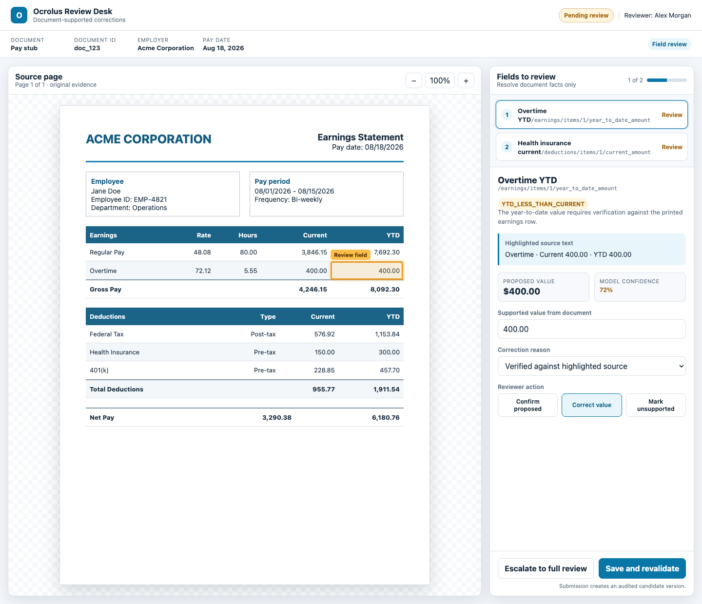

# Plain-English System Overview

> Draft companion to [`DESIGN.md`](DESIGN.md). This document explains what the
> system does and why. The technical design contains the implementation details,
> exact contracts, and open policy questions.

## What this system does

The system turns financial documents into trustworthy structured data. A lender
can submit a PDF, scan, or photo containing bank statements, W-2s, or pay stubs.
The system checks the files, prepares the pages, identifies each document, reads
the relevant fields, checks the result, and returns JSON that another system can
use.

The system reports only facts supported by the document. It does not guess
missing values, predict future income, or make a lending decision.

From the lender's point of view, at least 99% of the final fields it receives
must be correct, including any values corrected through human review. Accuracy
before review is tracked separately as an early warning about model quality and
review cost. The speed target is a result or review-ready decision in under 60
seconds for a standard document. Customer documents stay inside
company-controlled infrastructure.

The system is designed to reduce human review as far as accurate automation
allows, especially by reviewing only the affected fields when that is safe.
Human review remains a necessary exception path, however; the design does not
promise that every document can or should be completed without a person.

### How a document moves through the system

```mermaid
%%{init: {"theme": "base", "themeVariables": {"background": "#FFFDF7", "primaryTextColor": "#173B57", "lineColor": "#0EA5E9", "textColor": "#173B57", "edgeLabelBackground": "#FFFDF7", "fontFamily": "Inter, ui-sans-serif, system-ui"}}}%%
flowchart LR
    U["Upload"] --> S["Safety check"]
    S --> P["Prepare pages"]
    P --> C["Identify and separate documents"]
    C --> M["Extract facts and source evidence"]
    M --> V["Clean values and check the result"]
    V --> R{"Is the result trustworthy?"}
    R -->|"Yes"| D["Deliver JSON"]
    R -->|"A value is uncertain"| H["Targeted human review"]
    H --> V
    H -->|"The source cannot support a result"| X["Request a better upload"]

    classDef intake fill:#DBEAFE,stroke:#3B82F6,color:#1E3A8A,stroke-width:2px;
    classDef prepare fill:#CCFBF1,stroke:#14B8A6,color:#134E4A,stroke-width:2px;
    classDef model fill:#EDE9FE,stroke:#8B5CF6,color:#4C1D95,stroke-width:2px;
    classDef check fill:#FEF3C7,stroke:#F59E0B,color:#78350F,stroke-width:2px;
    classDef decision fill:#FCE7F3,stroke:#EC4899,color:#831843,stroke-width:2px;
    classDef success fill:#DCFCE7,stroke:#22C55E,color:#14532D,stroke-width:2px;
    classDef review fill:#FFEDD5,stroke:#F97316,color:#7C2D12,stroke-width:2px;
    classDef reject fill:#FFE4E6,stroke:#FB7185,color:#881337,stroke-width:2px;

    class U,S intake;
    class P,C prepare;
    class M model;
    class V check;
    class R decision;
    class D success;
    class H review;
    class X reject;
```

As a simple cost rule, the early checks use ordinary computing resources, while
the AI extraction step needs more expensive GPU capacity. Human review is more
expensive still because it requires a person's time.

### Where the system runs

```mermaid
%%{init: {"theme": "base", "themeVariables": {"background": "#FFFDF7", "primaryTextColor": "#173B57", "lineColor": "#0EA5E9", "textColor": "#173B57", "edgeLabelBackground": "#FFFDF7", "fontFamily": "Inter, ui-sans-serif, system-ui"}}}%%
flowchart LR
    L["Lender system"]
    HR["Authorized reviewer"]

    subgraph E["Company-controlled environment"]
        direction LR

        subgraph PE["Controlled access points"]
            API["Upload, status, and result API"]
            REV["Review application"]
        end

        subgraph PN["Private network"]
            STORE["Private object storage<br/>originals and page images"]
            QUEUE["Work queue"]
            CPU["Document workers<br/>safety, pages, classification, checks"]
            GPU["Private GPU model service<br/>field extraction"]
            DATA["Metadata and audit database"]
        end

        API --> STORE
        API --> DATA
        STORE --> QUEUE
        QUEUE --> CPU
        CPU --> STORE
        CPU --> GPU
        GPU --> CPU
        CPU --> DATA
        REV --> STORE
        REV --> DATA
    end

    L -->|"Encrypted upload and status requests"| API
    API -->|"Versioned JSON result"| L
    HR -->|"Time-limited, audited access"| REV

    classDef external fill:#DBEAFE,stroke:#3B82F6,color:#1E3A8A,stroke-width:2px;
    classDef access fill:#FEF3C7,stroke:#F59E0B,color:#78350F,stroke-width:2px;
    classDef review fill:#FCE7F3,stroke:#EC4899,color:#831843,stroke-width:2px;
    classDef storage fill:#CFFAFE,stroke:#06B6D4,color:#164E63,stroke-width:2px;
    classDef queue fill:#FFEDD5,stroke:#F97316,color:#7C2D12,stroke-width:2px;
    classDef worker fill:#CCFBF1,stroke:#14B8A6,color:#134E4A,stroke-width:2px;
    classDef model fill:#EDE9FE,stroke:#8B5CF6,color:#4C1D95,stroke-width:2px;
    classDef data fill:#DCFCE7,stroke:#22C55E,color:#14532D,stroke-width:2px;

    class L,HR external;
    class API access;
    class REV review;
    class STORE storage;
    class QUEUE queue;
    class CPU worker;
    class GPU model;
    class DATA data;

    style E fill:#FFF7ED,stroke:#FB923C,color:#7C2D12,stroke-width:2px;
    style PE fill:#FFFBEB,stroke:#FACC15,color:#713F12,stroke-width:2px;
    style PN fill:#ECFEFF,stroke:#22D3EE,color:#164E63,stroke-width:2px;
```

The public-facing services control access, but document storage, processing,
model inference, and review evidence remain inside the company environment. The
model workers do not send customer documents to public model APIs.

### Zoom: page preparation through extraction

```mermaid
%%{init: {"theme": "base", "themeVariables": {"background": "#FFFDF7", "primaryTextColor": "#173B57", "lineColor": "#0EA5E9", "textColor": "#173B57", "edgeLabelBackground": "#FFFDF7", "fontFamily": "Inter, ui-sans-serif, system-ui"}}}%%
flowchart LR
    SRC["A2 validated source"]

    subgraph A3["A3 · CPU page preparation"]
        direction TB
        RENDER["Render and safely correct pages"]
        QUALITY{"Page quality gate"}
        PAGES[("Prepared-page state")]
        RESUBMIT["Clear resubmission reason"]

        RENDER -->|"rendered pages"| QUALITY
        QUALITY -->|"usable pages + warnings"| PAGES
        QUALITY -->|"content is unavailable"| RESUBMIT
    end

    subgraph A4["A4 · CPU classification and conditional splitting"]
        direction TB
        TYPE["Document type classifier"]
        BOUNDARY["Document boundary detector"]
        NOVELTY["Template familiarity detector"]
        CONTEXT[("Document context")]

        TYPE -->|"page types + confidence"| BOUNDARY
        BOUNDARY -->|"ordered logical documents"| NOVELTY
        NOVELTY -->|"template family + familiarity + novelty"| CONTEXT
    end

    ROUTE{"CPU extraction work planner<br/>and routing policy"}

    subgraph A5["A5 · Private GPU extraction"]
        direction TB
        GENERAL["General Extraction Agent<br/>Qwen3-VL-8B baseline"]
        SPECIALIST["Template Specialist Agent<br/>future, only after evaluation"]
        RECOVERY["Recovery Extraction Agent<br/>future, one bounded retry"]
        CANDIDATE[("Typed candidate + source evidence")]

        GENERAL -->|"fields + evidence"| CANDIDATE
        SPECIALIST -.->|"fields + evidence"| CANDIDATE
        RECOVERY -.->|"replacement candidate"| CANDIDATE
    end

    CHECK{"A6–A8 validation and confidence gate"}
    ACCEPT["Deliver factual JSON"]
    REVIEW["Targeted human review"]

    SRC -->|"source ID + digest"| RENDER
    PAGES -->|"page IDs + quality signals"| TYPE
    CONTEXT -->|"type + pages + novelty + quality"| ROUTE
    ROUTE -->|"whole document or bounded page groups"| GENERAL
    ROUTE -.->|"approved template fast path"| SPECIALIST
    CANDIDATE --> CHECK
    CHECK -->|"all gates pass"| ACCEPT
    CHECK -->|"uncertain fields"| REVIEW
    CHECK -.->|"proven recoverable model failure"| RECOVERY

    classDef source fill:#DBEAFE,stroke:#3B82F6,color:#1E3A8A,stroke-width:2px;
    classDef cpu fill:#CCFBF1,stroke:#14B8A6,color:#134E4A,stroke-width:2px;
    classDef gate fill:#FEF3C7,stroke:#F59E0B,color:#78350F,stroke-width:2px;
    classDef state fill:#CFFAFE,stroke:#06B6D4,color:#164E63,stroke-width:2px;
    classDef agent fill:#EDE9FE,stroke:#8B5CF6,color:#4C1D95,stroke-width:2px;
    classDef future fill:#FFEDD5,stroke:#F97316,color:#7C2D12,stroke-width:2px;
    classDef success fill:#DCFCE7,stroke:#22C55E,color:#14532D,stroke-width:2px;
    classDef human fill:#FCE7F3,stroke:#EC4899,color:#831843,stroke-width:2px;
    classDef error fill:#FFE4E6,stroke:#FB7185,color:#881337,stroke-width:2px;

    class SRC source;
    class RENDER,TYPE,BOUNDARY,NOVELTY cpu;
    class QUALITY,ROUTE,CHECK gate;
    class PAGES,CONTEXT,CANDIDATE state;
    class GENERAL agent;
    class SPECIALIST,RECOVERY future;
    class ACCEPT success;
    class REVIEW human;
    class RESUBMIT error;

    style A3 fill:#ECFEFF,stroke:#22D3EE,color:#164E63,stroke-width:2px;
    style A4 fill:#F0FDFA,stroke:#2DD4BF,color:#134E4A,stroke-width:2px;
    style A5 fill:#FAF5FF,stroke:#A78BFA,color:#4C1D95,stroke-width:2px;
```

Each solid node is a bounded job, each labeled edge is the state handed to the
next job, and each decision point exposes its alternate route. A4 remains CPU
classification and matching rather than an agentic system. Dashed A5 paths are
future options, not launch decisions.

The execution graph includes deterministic CPU nodes, shared-state nodes,
routing and validation gates, GPU model agents, and human or resubmission
endpoints. An agent is one kind of graph node; the graph is not limited to
agents.

## 1. Receive the upload

### What it is

The lender uploads one or more files. The system gives the submission and each
uploaded file a stable ID, stores the original bytes, and starts processing only
after the upload is complete.

### Why it is important

Keeping the original unchanged means the system can always show what was
actually submitted. Stable IDs also let every later page, value, warning, and
review action point back to the correct customer file.

### Cost and speed impact

Direct upload to private object storage avoids moving large files through the
application servers. This keeps intake short and limits compute cost. Storage
cost grows with document volume and retention time, so the final retention
period still needs a business and compliance decision.

## 2. Make sure the file is safe to open

### What it is

Before any page is read, the system checks that the file really is a supported
PDF or image and is not encrypted, damaged, malicious, or unreasonably large.
Unsafe files are isolated. Customer-fixable problems, such as a password-locked
PDF, receive a clear resubmission message.

### Why it is important

This stage does not decide whether the document is a pay stub or whether a
financial value is correct. It only decides whether the next stage can safely
open the file. That keeps unsafe or structurally broken inputs away from the
rendering and model services.

### Cost and speed impact

These are bounded CPU checks and are much less expensive than running the
extraction model. Rejecting an unusable file here avoids paying to render it or
send it to a GPU. The current technical draft gives upload finalization and file
validation a combined initial budget of five seconds at p95, but that budget has
not yet been measured under load.

## 3. Prepare each page and check its quality

### What it is

The system turns the uploaded file into a consistent set of page images. It
makes sure pages are upright, at a useful size, and connected to the correct
original page. It also checks for problems such as blur, darkness, missing
edges, or blank pages.

A dedicated document-processing worker does this automatically inside the
private environment. It receives the job from the work queue, reads the approved
file from private storage, and uses local PDF rendering and image-processing
software. Supported DOCX files are converted locally first. The prepared pages
and quality results go back to private storage before A4 begins.

This step does not use Qwen. The vision-language model appears in A5, after A4
has grouped the pages and identified the document type. Candidate local tools
for A3 are Poppler or MuPDF for PDF pages, libvips and OpenCV for image work, and
headless LibreOffice for DOCX conversion; the final tool choices still require
benchmarking.

### Why it is important

Common problems such as rotation should be handled automatically. A genuinely
unreadable page should normally lead to a request for a clearer upload. Sending
a page to a person at this point should be a corner case; human review is more
valuable later when the page is readable but a particular value is uncertain.

This preparation also lets later stages point back to the exact place where a
value appeared, such as highlighting the gross-pay amount on page two.

### Cost and speed impact

The worker uses ordinary CPU capacity rather than an extraction GPU, and the
cost grows with the number of pages. Image size is the important tradeoff: an
image that is too small can hurt accuracy, while one that is unnecessarily large
makes the extraction model slower and more expensive. Catching blank or unusable
pages here prevents wasted model work. The exact rendering settings and time
budget are not yet chosen.

## 4. Identify documents and split only when necessary

### What it is

The normal assumption is that one uploaded file is one logical document. The
system classifies that document as a bank statement, W-2, pay stub, or unknown.
It opens the page-splitting path only when there is clear evidence that the file
contains more than one document, such as a document-type change or the start of
a second form.

For example, a five-page bank-statement PDF normally remains one document. A
two-page PDF containing two separate W-2s becomes two logical documents. An
ambiguous boundary is flagged rather than forced.

### Why it is important

This prevents the extraction model from applying the wrong fields to the wrong
document. It also handles the brief's explicit case in which one PDF contains
multiple W-2s without making every ordinary upload pay the complexity of full
package splitting.

### Cost and speed impact

Using the file boundary as a strong starting point keeps the common path fast
and reduces false splits. Classification still adds processing, but it prevents
the more expensive extraction model from running with the wrong document type
or page group. A small specialized classifier would generally cost less than
using the full extraction model for every page, while sharing a model could
simplify the system. The technical design has not yet chosen the classifier or
assigned this stage a time budget.

## 5. Read the document

### What it is

A fine-tuned open-weight vision model reads each logical document and returns
the requested facts. For a pay stub, that includes identity, pay-period dates,
earnings, deductions, and net pay. The model also records where each proposed
value appeared on the page. The initial design uses one self-hosted **General
Extraction Agent**, provisionally based on Qwen3-VL-8B-Instruct.

Before the model runs, a lightweight CPU step called the **Extraction Work
Planner** decides how to send the document to the model. It does not use a
simple character-count cutoff, because scans are images and their real workload
depends on resolution, visual tokens, table density, expected output, and the
selected model and GPU:

- If the full document fits the approved workload and time budget, one General
  Extraction Agent reads it as a whole.
- If it does not fit, the planner splits it at safe page or section boundaries,
  runs a limited number of General Extraction Agent instances in parallel, and
  merges their answers in source-page order.

Short pay stubs and W-2s will usually stay whole. Long bank statements are more
likely to be split into consecutive page groups. The rule uses measured work,
not the document label alone.

### Why it is important

The model runs on infrastructure controlled by the company, so customer
documents are not sent to a commercial model API. The exact checkpoint must
still win a held-out comparison; the project does not claim that the provisional
model has already achieved the accuracy target. Additional Recovery or
Specialist Agents are added only if testing identifies a repeatable problem that
they solve well enough to justify their extra cost and complexity.

Keeping a document whole preserves relationships between its pages and avoids
merge mistakes. However, sending too much visual material in one request can
exceed the model's context or GPU-memory limits, slow down sharply, or truncate
the response. Splitting everything would create the opposite problem: repeated
work and missing cross-page context. The planner makes that tradeoff explicit
and uses the minimum amount of splitting needed.

Fine-tuning happens outside the live request. Human evaluators verify training
examples and compare proposed model releases with a separate golden set. A
previously unseen company format still runs immediately through the General
Extraction Agent; it is reviewed only if extraction or later checks find a real
problem, unless a policy or regulatory requirement says otherwise.

### Cost and speed impact

This policy exists because neither extreme is cost-effective. Sending every
document as one request makes small files efficient but can make large files
slow or exceed GPU memory. Splitting every document makes individual requests
smaller but repeats model instructions and shared context, adds merge work, and
creates more GPU requests even when one would have worked.

This is expected to be the most GPU-intensive part of the automatic path.
Larger models may improve difficult extractions but take more time and computing
capacity. A smaller model may be faster and cheaper but is useful only if it
meets the accuracy requirement. Model comparison must measure accuracy, latency,
hardware use, and the rate at which documents still need human review. The
system keeps Qwen3-VL-8B only if that end-to-end test shows it meets the customer
accuracy and speed requirements at the lowest acceptable total cost.

Parallel processing can reduce the time a large document spends in this step,
but it does not reduce the total model work. It can cost slightly more because
each group repeats instructions and shared context, and too much parallel work
can slow other documents waiting for the same GPUs. The planner therefore uses
the cheapest execution shape expected to meet the time budget: one model call
when it safely fits, and capped parallel groups only when the document is large
enough to need them.

The exact visual-token, page, output, time, and parallelism limits are **TBD**.
They will be set by benchmarking the chosen model on the intended GPUs with
representative documents and realistic concurrent traffic, then stored in a
versioned serving profile.

An additional Recovery or Specialist Agent must beat the one-agent system on a
repeatable group of failures. It is added only when the resulting reduction in
errors or human review is worth more than its extra GPU and operating cost while
preserving the accuracy and speed targets. The remaining policy questions are
the exact endpoint for the 60-second target and whether human verification is
required on every document or only selected exceptions.

These comparisons happen before release using held-out documents and
production-like hardware. Once live, the system continues checking whether real
formats, costs, review rates, and latency match those assumptions; production
evidence can trigger another controlled model comparison.

## 6. Turn the reading into clean, typed values

### What it is

Model output is treated as a proposed reading, not as the final answer. This
stage puts dates, money, names, and line items into the agreed schema. A value
that is not supported by the document remains `null` rather than being guessed.

### Why it is important

For example, money is represented consistently, dates use one format, and
unfamiliar deduction labels are kept instead of discarded.

### Cost and speed impact

Normalization is lightweight CPU work, so its direct cost should be small. Its
larger benefit is avoiding downstream cleanup and making the validation rules
dependable.

## 7. Sanity checker

### What it is

This is the pipeline's sanity checker. It applies deterministic rules to the
typed values, which means the same input always produces the same result. For a
pay stub, it looks for missing critical values, impossible date order,
incomplete line items, current or year-to-date line items that do not match
their printed totals, and gross pay minus deductions that does not equal net
pay.

The checker records a stable reason and the exact fields involved. It does not
ask the AI model for a second opinion, change a value, move an amount to another
row, or insert a zero so the totals work. A difference greater than one cent
fails the initial pay-stub arithmetic rule when all required operands are
present. If a value is absent, it stays absent and is handled by the
missing-value and review policy.

### Why it is important

These checks catch known contradictions cheaply and consistently, and they
prevent a high AI confidence score from excusing arithmetic that does not work.
Passing the checks does not prove that the document was read correctly: two
wrong values can still add up. The confidence and review decision therefore
still follows.

When a person corrects a field later, the corrected result comes through these
same checks again before delivery. This catches a new inconsistency introduced
during review and keeps the rule outcome auditable through a rules version.

### Cost and speed impact

The checks are bounded local CPU work inside the private environment. They use
no GPU, public model API, or additional rendering, so they should consume only
a small part of the 60-second path; the actual p95 time still has to be measured
rather than claimed. They can prevent an inconsistent result from reaching a
lender and can point a reviewer to only the affected fields. Rules that are too
aggressive create unnecessary review time, so evaluation measures false alarms,
reviewer minutes, and incorrect fields that pass the rules as well as compute
cost. These checks contribute to the 99%+ goal but cannot establish it by
themselves.

## 8. Traffic controller

### What it is

The traffic controller combines field-level confidence with the sanity
checker's issues and sends the result down one of four paths:

- accept it automatically;
- send only specific fields for review;
- send the whole document for review; or
- reject an unusable input.

It considers confidence one field at a time, so a strong average cannot hide a
weak critical value such as gross pay or net pay. It does not guess production
thresholds. The prototype's numbers only demonstrate how routing works; real
thresholds are selected from measured results on held-out documents.

### Why it is important

The goal is at least 99% correct final delivered fields while keeping the
automatic path under 60 seconds and minimizing model and reviewer cost. Those
requirements can pull in different directions. Sending everything to people
may improve final accuracy but would fail the purpose of automation; accepting
everything would be cheap but unsafe. Rejecting every difficult but usable
document would also make accuracy look better without serving the customer.
Tracking automatic accuracy, successful completion, rejection, and review
volume separately makes those trade-offs visible.

The system hill-climbs toward the goal. It first measures a baseline on verified
golden documents, calibrates model scores against observed correctness, and
searches for routing policies that meet the accuracy and speed gates, maximize
successful completion and automation, and then minimize cost. It freezes that
policy and checks it once on untouched test documents.
Remaining errors are grouped by field, document type, image quality, and format;
the team improves the largest failure group and repeats the comparison.

After launch, verified reviewer corrections feed later evaluation, and a random
sample of automatically accepted results is audited. Otherwise the system would
learn only from cases it already knew were difficult and could miss errors in
the automatic path.

### Cost and speed impact

The online routing calculation is bounded private CPU work and makes no model
or public API call, so its direct time and compute cost are small. Its policy
has a large indirect effect: strict routing increases reviewer minutes and queue
time, while loose routing increases the chance of a wrong automatic result.
Each policy version is therefore evaluated on final and automatic accuracy,
review volume, latency, and total cost rather than confidence alone. The actual
thresholds remain open until those measurements exist.

## 9. Review desk

### What it is

When review is necessary, an authorized reviewer works in a two-pane screen.
The original page and highlighted source evidence remain visible on the left.
The right side shows the fields requiring attention, the proposed value, the
reason it was flagged, nearby document context, and the correction control.

The reviewer can confirm the proposed reading, correct it, mark the value
unsupported, or escalate the task. A field review asks only about a small,
safe set of values. A full review exposes the complete logical document when a
critical field, arithmetic contradiction, or broad uncertainty requires more
context. Reviewers report document facts; they do not predict income or make a
lending decision.

*This preview is stored in the repository and renders with the overview. The
runnable simulation is in `review-desk-site/` and consumes the same internal
review-task fixture produced by the Python router. Its actions are local-only;
it does not claim to implement the production queue, audit store, or
revalidation service.*

### Why it is important

The original model observation is never overwritten. Each confirmation,
correction, unsupported value, or escalation creates an audited candidate
version. Corrected values go back through typed parsing, the sanity checker, and
the traffic controller before delivery. If a contradiction remains, the task
reopens or escalates instead of being automatically accepted.

Reviewers are not assumed perfect. Verified audit tasks and random quality
sampling measure false confirmations, correction accuracy, agreement, and
rework. Only corrections that pass the required quality checks can become
future evaluation or training examples, and they never change a live model or
threshold directly.

### Cost and speed impact

Human review is the slowest and most expensive path, so it is reserved for
uncertainty that automation cannot safely resolve. Targeted field review
should cost less than full-document review. The entire review cycle is designed
to minimize how often a person is needed, but accuracy takes priority and human
need cannot be promised away. Review completion is separate from the
under-60-second automatic or review-ready target; staffing, turnaround time, and
acceptable review rate still need product decisions.

## 10. Deliver the result

### What it is

The system returns versioned JSON for each logical document, but extracted
business values appear only after the result is complete. If automation needs a
reviewer, the lender receives `NEEDS_REVIEW` and identifiers only. After all
checks pass, the full result is labeled `COMPLETED_AUTO` or
`COMPLETED_HUMAN_VERIFIED`. If a human confirms that the source cannot support a
trustworthy result, the lender receives `UNPROCESSABLE` without candidate data.

Detailed confidence, validation findings, evidence, and review history remain
inside the controlled review and audit system. A human-verified result uses a
distinct status and no fabricated confidence score. Result revisions are
immutable, so a correction never erases the earlier machine output.

### Why it is important

The result reports what the document says. It does not annualize variable income
or decide whether the borrower qualifies for a loan. Withholding incomplete
data prevents a lender integration from accidentally consuming an uncertain
candidate, while internal version and evidence data keep the result explainable
and reproducible.

### Cost and speed impact

Producing and delivering JSON uses little compute compared with model
inference. With no lender integration details available, the proposed default
is a small signed webhook containing identifiers, status, event ID, and revision,
followed by authenticated result retrieval with polling as fallback. At-least-
once delivery, deduplication, bounded retry, and immutable revisions avoid lost
results without claiming unrealistic exactly-once delivery. The main ongoing
costs are secure storage, delivery traffic, and keeping enough internal audit
information to explain a result.

## 11. Keep the service reliable and private

### What it is

The production system needs monitoring for queue delays, stage failures,
processing time, model errors, review rates, and cost. Logs should contain IDs,
durations, and reason codes rather than customer document contents. Model
workers and private storage should not have unrestricted access to the public
internet.

### Why it is important

These controls make failures visible while keeping sensitive financial content
inside the company-controlled environment.

### Cost and speed impact

Monitoring, spare capacity, backups, and reliable queues add ongoing
infrastructure cost, but they are necessary to maintain the speed and
availability targets. GPU capacity is likely to be the largest online compute
cost. The technical design still needs concrete traffic assumptions, recovery
goals, and cost targets before sizing the system.

## 12. Measure accuracy and improve the system

### What it is

The 99% target measures the correctness of the final fields delivered to the
lender, after any necessary human correction. It must be measured end to end on
a held-out golden dataset, not assumed from a model name or a few examples.
Automatic accuracy before review is tracked as a leading indicator, alongside
review volume, corrections, rejections, and review time.

### Why it is important

Reviewed corrections can improve future training data, but they should be
checked before use. A new model or policy should replace the current version
only after it passes the agreed accuracy, latency, and cost gates.

### Cost and speed impact

Evaluation and fine-tuning are offline costs rather than work added to every
document request. Training can be expensive, but better models and thresholds
can reduce repeated extraction failures and human-review cost. The retraining
schedule and promotion gates are not yet designed.

## Future: return one package-level result

### What it is

The current contract returns one result for one logical pay stub. A future
submission envelope can group results for several pay stubs, W-2s, and bank
statements while keeping each document's status and evidence separate. It may
report factual cross-document observations, but it will not predict income or
apply underwriting policy.

### Why it is important

Lenders submit packages, but each document still needs its own status, evidence,
and review outcome. The envelope can present those results together without
changing their meaning.

### Cost and speed impact

Grouping existing document results should add modest coordination and storage
work. The main cost still comes from processing each document inside the
package. Package-level timing rules have not yet been defined.
